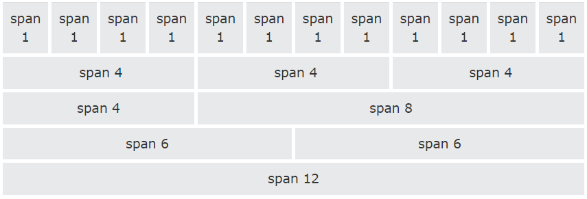
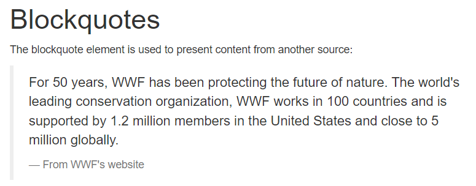
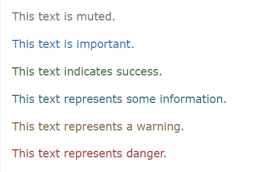

# Bootstrap
Bootstrap 3 is a popular front-end framework that helps developers create responsive and mobile-first web applications quickly and easily. Here’s an overview of the key features, components, and concepts you need to know about Bootstrap 3.
## Contents:
- [Grid system](#grid-system)
- [Typography](#typography)
## Grid System
### Responsive Design
Bootstrap's grid system allows up to 12 columns across the page.
 
If you do not want to use all 12 columns individually, you can group the columns together to create wider columns:

### Grid Classes
The Bootstrap grid system has four classes:
- xs (for phones - screens less than 768px wide)
- sm (for tablets - screens equal to or greater than 768px wide)
- md (for small laptops - screens equal to or greater than 992px wide)
- lg (for laptops and desktops - screens equal to or greater than 1200px wide)

### Grid Nesting 
You can nest columns within another column.
### Offsetting Columns
You can create space between columns using .col-md-offset-* classes.
### Column Ordering
You can reorder columns using .col-md-push-* and .col-md-pull-*.

## Typography
- **Global Defaults:**
  - **Font Size:** 14px
  - **Line Height:** 1.428
  - **Paragraphs (`
`):** Bottom margin equal to half of computed line height (10px by default).

- **Headings (`<h1>` - `<h6>`):**
  
  - `h1` - 36px 
  - `h2` - 30px
  - `h3` - 24px
  - `h4` - 18px
  - `h5` - 14px
  - `h6` - 12px
- **Small Text (`<small>`):**
  - Used for lighter, secondary text within headings.

- **Blockquotes (`<blockquote>`):**
  - Standard quote styling.
  - `.blockquote-reverse` class for right-aligned quotes.

- **Description Lists (`<dl>`):**
  - Descriptions formatted with terms (`<dt>`) and details (`<dd>`).
- **Inline Code (`<code>`):** 
  - Styled to distinguish code from regular text.
- **Keyboard Input (`<kbd>`):**
  - Styled to show keyboard shortcuts or input commands.

- **Preformatted Text (`<pre>`):**
  - Fixed-width font and preserved spaces/line breaks.

- **Contextual Text Colors:**

  - `.text-muted`: Muted text
  - `.text-primary`: Important text
  - `.text-success`: Success indication
  - `.text-info`: Informational text
  - `.text-warning`: Warning indication
  - `.text-danger`: Danger indication

- **Contextual Background Colors**
  - `.bg-primary`: Important background
  - `.bg-success`: Success background
  - `.bg-info`: Informational background
  - `.bg-warning`: Warning background
  - `.bg-danger`: Danger background

- **Typography Helper Classes**

    - **Text Alignment:**
    - `.text-left`, `.text-center`, `.text-right`, `.text-justify`
    - **Text Formatting:**
    - `.text-lowercase`, `.text-uppercase`, `.text-capitalize`, `.text-nowrap`
- **Lists:**
  - `.list-unstyled`: Removes list styles and margin.
  - `.list-inline`: Places list items in a single line.

- **Additional Typography Helpers**
    - **Paragraphs:**
    - `.lead`: Makes a paragraph stand out.
    - **Small Text:**
    - `.small`: Reduces text size to 85% of parent size.
    - **Initialism:**
    - `.initialism`: Slightly smaller font size for text inside `<abbr>`.