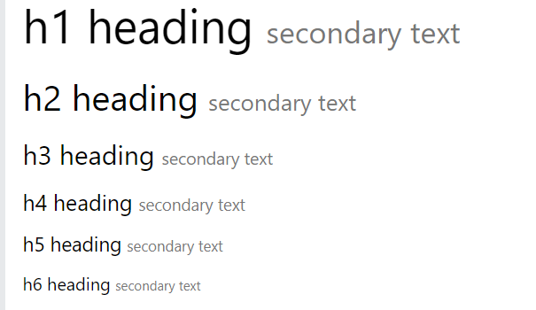

# Bootstrap
Bootstrap 3 is a popular front-end framework that helps developers create responsive and mobile-first web applications quickly and easily. Here’s an overview of the key features, components, and concepts you need to know about Bootstrap 3.
## Contents:
- [Grid system](#grid-system)
- [Typography](#typography)
- [Components](#components)
## Bootstrap styesheet and JS script
<pre>
&lt;link rel=&quot;stylesheet&quot; href=&quot;https://maxcdn.bootstrapcdn.com/bootstrap/3.4.1/css/bootstrap.min.css&quot;&gt;
&lt;script src=&quot;https://maxcdn.bootstrapcdn.com/bootstrap/3.4.1/js/bootstrap.min.js&quot;&gt;&lt;/script&gt;
</pre>

## Grid System
### Responsive Design
Bootstrap's grid system allows up to 12 columns across the page.
 
If you do not want to use all 12 columns individually, you can group the columns together to create wider columns:

### Grid Classes
The Bootstrap grid system has four classes:
- xs (for phones - screens less than 768px wide)
- sm (for tablets - screens equal to or greater than 768px wide)
- md (for small laptops - screens equal to or greater than 992px wide)
- lg (for laptops and desktops - screens equal to or greater than 1200px wide)

### Grid Nesting 
You can nest columns within another column.
### Offsetting Columns
You can create space between columns using .col-md-offset-* classes.
### Column Ordering
You can reorder columns using .col-md-push-* and .col-md-pull-*.

## Typography
- **Global Defaults:**
  - **Font Size:** 14px
  - **Line Height:** 1.428
  - **Paragraphs (`
`):** Bottom margin equal to half of computed line height (10px by default).

- **Headings (`<h1>` - `<h6>`):**
  - `h1` - 36px 
  - `h2` - 30px
  - `h3` - 24px
  - `h4` - 18px
  - `h5` - 14px
  - `h6` - 12px
- **Small Text (`<small>`):** Used for lighter, secondary text within headings.
 

- **Blockquotes (`<blockquote>`):**
  - Standard quote styling.
  - `.blockquote-reverse` class for right-aligned quotes.
   

- **Description Lists (`<dl>`):** Descriptions formatted with terms (`<dt>`) and details (`<dd>`).
- **Inline pre (`<pre>`):** Styled to distinguish pre from regular text.
- **Keyboard Input (`<kbd>`):** Styled to show keyboard shortcuts or input commands.

- **Preformatted Text (`<pre>`):** Fixed-width font and preserved spaces/line breaks.

- **Contextual Text Colors:**
  - `.text-muted`: Muted text
  - `.text-primary`: Important text
  - `.text-success`: Success indication
  - `.text-info`: Informational text
  - `.text-warning`: Warning indication
  - `.text-danger`: Danger indication
   
  

- **Contextual Background Colors**
  - `.bg-primary`: Important background
  - `.bg-success`: Success background
  - `.bg-info`: Informational background
  - `.bg-warning`: Warning background
  - `.bg-danger`: Danger background
   
  
- **Typography Helper Classes**

    - **Text Alignment:** `.text-left`, `.text-center`, `.text-right`, `.text-justify`
    - **Text Formatting:** `.text-lowercase`, `.text-uppercase`, `.text-capitalize`, `.text-nowrap`
- **Lists:**
  - `.list-unstyled`: Removes list styles and margin.
  - `.list-inline`: Places list items in a single line.

- **Additional Typography Helpers**
    - **Paragraphs:** `.lead`: Makes a paragraph stand out.
    - **Small Text:** `.small`: Reduces text size to 85% of parent size.
    - **Initialism:** `.initialism`: Slightly smaller font size for text inside `<abbr>`.

## Components
Bootstrap 3 is a popular front-end framework that helps developers create responsive and mobile-first web applications quickly and easily. Here’s an overview of the key features, components, and concepts you need to know about Bootstrap 3:
- **Alerts:** Alerts are created with the `.alert` class, followed by one of the four contextual classes `.alert-success`, `.alert-info`, `.alert-warning` or `.alert-danger`:
   <pre>
   &lt;div class=&quot;alert alert-success alert-dismissible&quot;&gt;
   &lt;a href=&quot;#&quot; class=&quot;close&quot; data-dismiss=&quot;alert&quot; aria-label=&quot;close&quot;&gt;&amp;times;&lt;/a&gt;
   &lt;strong&gt;Success!&lt;/strong&gt; Indicates a successful or positive action.
   &lt;/div&gt;
   </pre>
   

- **Buttons:**  Pre-styled buttons with classes like `.btn`, `.btn-default`, `.btn-primary`, `.btn-success`, `.btn-info`, `.btn-warning`, `.btn-danger`, `.btn-link`, etc.

   
   The classes that define the different sizes are: `.btn-lg`,`.btn-sm`, `.btn-xs`
   
   A button can be set to an active (appear pressed) or a disabled (unclickable) state:
   
- **Badge & Labels:** 
   -  Badges are numerical indicators of how many items are associated with a link or element.
   -  We can use `.label` class,  followed by one of the six contextual classes `.label-default`, `.label-primary`, `.label-success`, `.label-info`, `.label-warning` or `.label-danger`, within a &lt;span&gt; element to create a label
    
- **Forms:** Customizable form controls including input fields, checkboxes, radio buttons, etc., with classes like `.form-control`.

- **Navbars:** Responsive navigation bars that can collapse on smaller screens. Use `.navbar`, `.navbar-default`, and `.navbar-inverse`.
- **Panels:** Panels for creating bordered boxes with headers, footers, and other content. Use `.panel`, `.panel-heading`, `.panel-body`.
- **Modals:** JavaScript-powered dialog boxes for displaying content or alerts. Trigger with data attributes or JavaScript.
- **Tabs and Pills:** Navigation elements like tabs (`.nav-tabs`) and pills (`.nav-pills`) for switching between content.
- **Progress Bars:** Indicate progress with `.progress` and `.progress-bar` classes. The contextual classes that can be used with progress bars are: `.progress-bar-success`, `.progress-bar-info`, `.progress-bar-warning`, `.progress-bar-danger`
   <pre>
   &lt;div class=&quot;progress&quot;&gt;
   &lt;div class=&quot;progress-bar progress-bar-success&quot; role=&quot;progressbar&quot; aria-valuenow=&quot;40&quot; aria-valuemin=&quot;0&quot; aria-valuemax=&quot;100&quot; style=&quot;width:40%&quot;&gt;
      40% Complete (success)
   &lt;/div&gt;
   &lt;/div&gt;
   </pre>
     
   `.progress-bar-striped` to add stripes to the progress bars.
   `.progress-bar-striped` and `.active`to animate the progress bar.

## **JavaScript Plugins**
   - **Transitions:** Smooth animations for elements.
   - **Dropdowns:** Toggleable dropdown menus.
   - **Tooltips and Popovers:** Hover or click-triggered small overlays.
   - **Carousel:** Image sliders with controls and indicators.
   - **Collapse:** Expandable content areas.
   - **Affix:** Pin elements to a specific position while scrolling.

### 5. **Customizable**
   - Bootstrap 3 is highly customizable using LESS or CSS. You can override default styles or customize the grid, components, and plugins according to your needs.

### 6. **Responsive Utilities**
   - Classes like `.hidden-xs`, `.visible-sm`, `.visible-md`, etc., to show or hide content based on screen size.

### 7. **Browser Compatibility**
   - Bootstrap 3 supports all modern browsers and offers partial support for older browsers like Internet Explorer 8 and 9.

### 8. **Mobile First**
   - Bootstrap 3 is designed with a mobile-first approach, meaning it prioritizes the mobile user experience and then scales up for larger screens.

### 9. **Icons**
   - **Glyphicons:** Bootstrap 3 includes Glyphicons, a set of icons that you can easily add to your buttons, forms, and other elements.

### 10. **Migration from Bootstrap 2**
   - Bootstrap 3 introduced significant changes from Bootstrap 2, including the shift to a mobile-first approach, which requires careful attention when migrating existing projects.

### 11. **Documentation**
   - Bootstrap 3 has comprehensive documentation available on its official website, with detailed examples and explanations for each component and feature.

### 12. **Installation**
   - **CDN:** Bootstrap 3 can be easily added to a project using a CDN link.
   - **Download:** You can also download the Bootstrap 3 files and include them in your project manually.

### Summary
Bootstrap 3 remains a powerful tool for building responsive websites quickly. Its grid system, extensive components, JavaScript plugins, and customization options make it a versatile framework for front-end development. While it has been succeeded by Bootstrap 4 and 5, many projects still rely on Bootstrap 3 for its stability and established patterns.