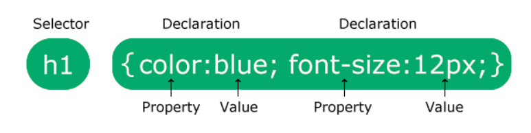
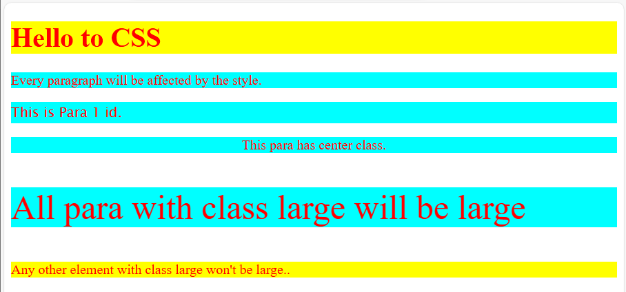
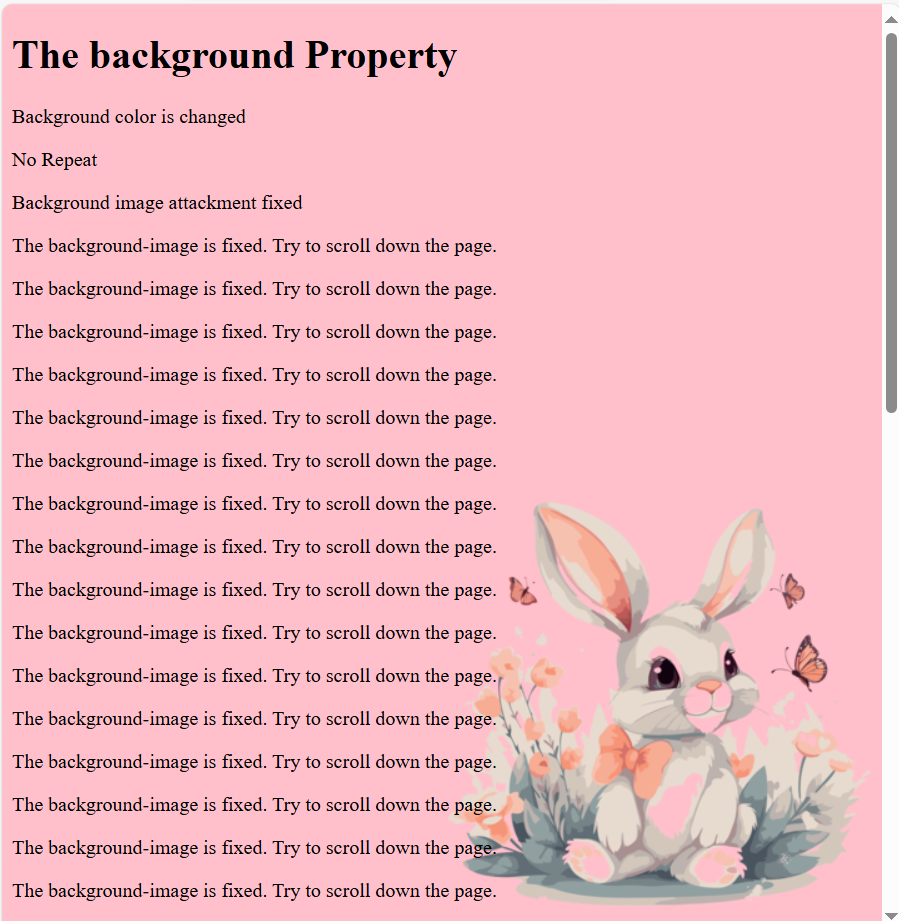

# CSS

<h3>CSS is used to define styles for your web pages, including the design, layout, and variations in display for different devices and screen sizes.</h3>

## CSS Syntax

  
Here,

- The selector points to the HTML element you want to style.
- The declaration block contains one or more declarations separated by semicolons.
- Each declaration includes a CSS property name and a value, separated by a colon.
- Multiple CSS declarations are separated with semicolons, and declaration blocks are surrounded by curly braces.

## CSS Selectors

- The CSS Universal Selector
- The CSS element Selector
- The CSS id Selector
- The CSS class Selector
- The CSS Combination Selector
- The CSS Grouping Selector

    

    <h3><ins>HTML Code</ins></h3>
    <pre>
        &lt;body&gt;
        &lt;h1&gt;Hello to CSS&lt;/h1&gt;
        &lt;p&gt;Every paragraph will be affected by the style.&lt;/p&gt;
        &lt;p id="para1"&gt;This is Para 1 id.&lt;/p&gt;
        &lt;p class="center"&gt;This para has center class.&lt;/p&gt;
        &lt;p class="large"&gt;All para with class large will be large&lt;/p&gt;
        &lt;div class="large"&gt;Any other element with class large won't be large..&lt;/div&gt;
        &lt;/body&gt;
    </pre>
    <h3><ins>CSS Code</ins></h3>
    <pre>
    *{
    color: red;
    }
    p {
        background-color: aqua;
    }
    #para1{
        font-family: 'Lucida Sans', 'Lucida Sans Regular', 'Lucida Grande', 'Lucida Sans Unicode', Geneva, Verdana, sans-serif;
    }
    .center{
        text-align: center;
    }
    p.large{
        font-size: 40px;
    }
    h1,div{
        background-color: yellow;
    }
    </pre>
    

    

    <h3><ins>Output</ins></h3>
    

## CSS Backgrounds

    <h3><ins>CSS code</ins></h3>
    <pre>
body{
background-color: pink;
background-image: url(cssimages/sticket.png);
background-repeat: no-repeat;
background-position: right bottom;
background-attachment: fixed;
}
    </pre>
    

<h3><ins>Background Shorthand</ins></h3>

To shorten the code, it is also possible to specify all the background properties in one single property. This is called a shorthand property.

    <table>
        <thead>
            <tr>
            <th>Full Form</th>
            <th>Short Form</th>
            </tr>
        </thead>
        <tbody>
            <tr>
                <td>
                    <pre>
body {
  background-color: #ffffff;
  background-image: url("img_tree.png");
  background-repeat: no-repeat;
  background-position: right top;
}
                    </pre>
                </td>
                <td>
                    <pre>
body {
  background: #ffffff url("img_tree.png") no-repeat right top;
}
                    </pre>
                </td>
            </tr>
        </tbody>
    </table>

