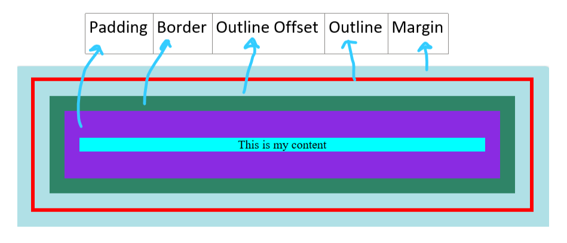
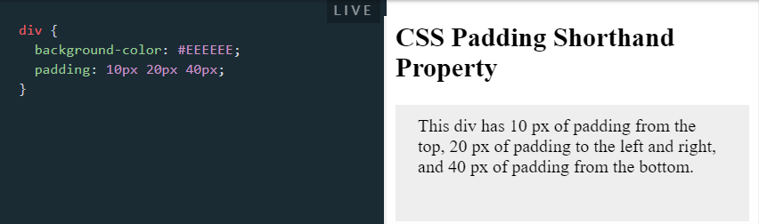
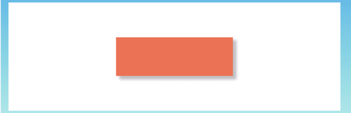

# CSS

<h2>CSS stands for Cascading Style Sheets.<small>  CSS is used to define styles for your web pages, including the design, layout, and variations in display for different devices and screen sizes.</small></h2>

## Topics
- [CSS Syntax](#css-syntax)
- [CSS Selectors](#css-selectors)
- [CSS Combinators](#css-combinators)
- [CSS Pseudoclass](#css-pseudo-classes)
- [CSS Background](#css-backgrounds)
- [Box Model](#box-model)
- [Border](#border)
- [Padding](#padding)
- [CSS Dimensions](#css-dimensions)
- [CSS Text Alignment/Direction Properties](#css-text-alignmentdirection-properties)
- [CSS Font](#css-font)
- [Styling Links](#styling-links)
- [Different kind of cursors](#different-kind-of-cursors)
- [Tables](#tables)
- [CSS Display Properties](#css-display-properties)
- [max--min](#using-width-max-width-and-margin-auto)
- [CSS Layout - Position Property](#css-layout---position-property)
- [CSS Overflow](#css-overflow)
- [What is !important?](#what-is-important)
- [Media Query](#media-query)
- [Specificity Hierarchy](#specificity-hierarchy)
- [Flexbox](#flexbox)
- [CSS Shorthands](#css-shorthands)

## CSS Syntax
  
Here,

<li>The selector points to the HTML element you want to style.
<li>The declaration block contains one or more declarations separated by semicolons.
<li>Each declaration includes a CSS property name and a value, separated by a colon.
<li>Multiple CSS declarations are separated with semicolons, and declaration blocks are surrounded by curly braces.

🔼 [Back to Top](#topics)

## CSS Selectors

<li>The CSS Universal Selector '*'
<li>The CSS element Selector ' '
<li>The CSS id Selector '#'
<li>The CSS class Selector '.'
<li>The CSS Combination Selector 
<li>The CSS Grouping Selector

    

    <h4><ins>HTML Code</ins></h4>
    <pre>
  &lt;body&gt;
  &lt;h1&gt;Hello to CSS&lt;/h1&gt;
  &lt;p&gt;Every paragraph will be affected by the style.&lt;/p&gt;
  &lt;p id="para1"&gt;This is Para 1 id.&lt;/p&gt;
  &lt;p class="center"&gt;This para has center class.&lt;/p&gt;
  &lt;p class="large"&gt;All para with class large will be large&lt;/p&gt;
  &lt;div class="large"&gt;Any other element with class large won't be large..&lt;/div&gt;
  &lt;/body&gt;
    </pre>
    <h4><ins>CSS Code</ins></h4>
    <pre>
    *{
    color: red;
    }
    p {
        background-color: aqua;
    }
    #para1{
        font-family: 'Lucida Sans', 'Lucida Sans Regular', 'Lucida Grande', 'Lucida Sans Unicode', Geneva, Verdana, sans-serif;
    }
    .center{
        text-align: center;
    }
    p.large{
        font-size: 40px;
    }
    h1,div{
        background-color: yellow;
    }
    </pre>
    

    

    <h4><ins>Output</ins></h4>
    

🔼 [Back to Top](#topics)

## CSS Combinators
There are four different combinators in CSS:

- descendant selector (space)
    - Matches all elements that are descendants of a specified element.
    
- child selector (>)
    - Selects all elements children of a specified element.
    
- adjacent sibling selector (+)
    - The adjacent sibling selector is used to select an element that is directly after another specific element.

    - Sibling elements must have the same parent element, and "adjacent" means "immediately following".
- general sibling selector (~)
    - The general sibling selector selects all elements that are next siblings of a specified element.
  
🔼 [Back to Top](#topics)

## CSS Pseudo-classes
A pseudo-class is used to define a special state of an element. 
For example, different states of Anchor tag are:
<pre>
/* unvisited link */
a:link {
  color: #FF0000;
}

/* visited link */
a:visited {
  color: #00FF00;
}

/* mouse over link */
a:hover {
  color: #FF00FF;
}

/* selected link */
a:active {
  color: #0000FF;
}
</pre>
Another pseudo-classes are:
- The <b>:first-child</b> pseudo-class matches a specified element that is the first child of another element.
- The <b>:lang</b> pseudo-class allows to define special rules for different languages.

🔼 [Back to Top](#topics)
## CSS Backgrounds

    <h3><ins>CSS code</ins></h3>
    <pre>
body{
background-color: pink;
background-image: url(cssimages/sticket.png);
background-repeat: no-repeat;
background-position: right bottom;
background-attachment: fixed;
}
    </pre>
    

<h3><ins>Background Shorthand</ins></h3>

To shorten the code, it is also possible to specify all the background properties in one single property. This is called a shorthand property.

    <table>
        <thead>
            <tr>
            <th>Full Form</th>
            <th>Short Form</th>
            </tr>
        </thead>
        <tbody>
            <tr>
                <td>
                    <pre>
body {
  background-color: #ffffff;
  background-image: url("img_tree.png");
  background-repeat: no-repeat;
  background-position: right top;
}
                    </pre>
                </td>
                <td>
                    <pre>
body {
  background: #ffffff url("img_tree.png") no-repeat right top;
}
                    </pre>
                </td>
            </tr>
        </tbody>
    </table>

🔼 [Back to Top](#topics)
## Box Model
Every CSS element is essentially a box. Every element is a generic box.
 The box model explains the sizing of the elements based on a few CSS
 properties. 
 From the inside to the outside, we have:
 - the content area
 - padding
 - border
 - outline
 - margin

🔼 [Back to Top](#topics)
## Border
 The border is a thin layer between padding and margin. Some border properties are:
- `border-style` 
- `border-color`
- `border-width`

The **border-style**  property let us choose the style of the border. The options we can use are: `dotted`, `dashed`, `solid`, `double`, `groove`, `ridge`, `inset`, `outset` etc.

**The border shorthand property :** `border-width` , 
`border-style`  and `color`  can be set using the borer shorthand property. 
 Example: `border: 2px black solid;`  
Also we can use the **edge-specific properties** 
`border-top` , 
`border-right` ,
 `border-bottom` , 
`border-left`. 
 Example:
 <pre>
p { 
border-left: 2px black solid; 
border-right: 3px red dashed; 
}</pre>

🔼 [Back to Top](#topics)

## Padding
 The padding  CSS property is commonly used in CSS to add space in the
 inner side of an element.
*Remember:*
 - `margin`  adds space outside an element border
 - `padding`  adds space inside an element border

Four padding properties are:

- padding-top
- padding-right
- padding-bottom
- padding-left

**Using the padding  `shorthand` :**
- **1 value :**
 Using a single value, that applies to all the paddings: top, right, bottom, left. 
 Example: `padding: 20px;`
- **2 values :**
 Using 2 values applies the first to bottom & top, and the second to left & right. 
Example: `padding: 20px 10px;`
- **3 values :**
 Using 3 values applies the first to top, the second to left & right, the third
 to bottom. 
Example: `padding: 20px 10px 30px;` 
- **4 values :**
 Using 4 values applies to top, right, bottom and left side respectively. 
 Example: `padding: 20px 10px 5px 0px;`
 

🔼 [Back to Top](#topics)

## CSS Text Alignment/Direction Properties

- ### direction
  <ul>
  <li><b>ltr : </b>This text goes from left to right. This is default.</li>
  <li><b>rtl : </b>This text goes from right to left.</li>
  </ul>

- ### text-align
  <table>
      <tr>
          <td><b>left : </b></td>
          <td></td>
      </tr>
      <tr>
          <td><b>right : </b></td>
          <td></td>
      </tr>
      <tr>
          <td><b>center : </b></td>
          <td></td>
      </tr>
      <tr>
          <td><b>justify : </b></td>
          <td></td>
      </tr>
  </table>

- ### text-align-last
  Only the last line is aligned.

- ### vertical-allignment
  

- ### Text Decoration
  <ul>
  <li>
  text-decoration-line
  
  </li>
  <li>
  text-decoration-color
  </li>
  <li>text-decoration-style</li>
  <li>double, dotted, dashed, wavy
  </li>
  <li>text-decoration-thickness
  </li>
  </ul>

🔼 [Back to Top](#topics)
## CSS Font
- ### CSS Google Fonts
  <pre>
  &lt;head&gt;
  &lt;link rel=&quot;stylesheet&quot; href=&quot;https://fonts.googleapis.com/css?family=Sofia&quot;&gt;
  &lt;style&gt;
  body {
    font-family: &quot;Sofia&quot;, sans-serif;
  }
  &lt;/style&gt;
  &lt;/head&gt;
  </pre>
- ### CSS Web Safe Fonts
  

  There are no 100% completely web safe fonts. Therefore, developers always use fallback fonts. In examples below, last 2 fonts are fallback fonts.
  

  <pre>
  .p1 {
    font-family: "Times New Roman", Times, serif;
  }
  .p2 {
    font-family: Arial, Helvetica, sans-serif;
  }
  .p3 {
    font-family: "Lucida Console", "Courier New", monospace;
  }
  </pre>

- ### Responsive font-size with Viewport Width
  

  <b>Responsive Font Size : </b>The text size can be set with a vw unit, which means the "viewport width". Viewport is the browser window size. 1vw = 1% of viewport width. If the viewport is 50cm wide, 1vw is 0.5cm.
  
 

  
  

🔼 [Back to Top](#topics)

## Styling Links
The four links states are:

- a:link - a normal, unvisited link
- a:visited - a link the user has visited
- a:hover - a link when the user mouses over it
- a:active - a link the moment it is clicked

🔼 [Back to Top](#topics)

<!-- ## Different kind of cursors
<a href='https://tailwindcss.com/docs/cursor'>link</a>
- cursor: auto;
- cursor: default;
- cursor: pointer;
- cursor: wait;
- cursor: text;
- cursor: move;
- cursor: help;
- cursor: not-allowed;
- cursor: none;
- cursor: context-menu;
- cursor: progress;
- cursor: cell;
- cursor: crosshair;
- cursor: vertical-text;
- cursor: alias;
- cursor: copy;
- cursor: no-drop;
- cursor: grab;
- cursor: grabbing;
- cursor: all-scroll;
- cursor: col-resize;
- cursor: row-resize;
- cursor: n-resize;
- cursor: e-resize;
- cursor: s-resize;
- cursor: w-resize;
- cursor: ne-resize;
- cursor: nw-resize;
- cursor: zoom-in;
- cursor: zoom-out;

🔼 [Back to Top](#topics) -->

## Tables
- ### Striped Tables
  For zebra-striped tables, use the nth-child() selector and add a background-color to all even (or odd) table rows:
  tr:nth-child(even) {background-color: #f2f2f2;}
  
- ### Responsive Table
  A responsive table will display a horizontal scroll bar if the screen is too small to display the full content:
  
  

## CSS Display Properties
Some display properties:
- inline (Displays an element as an inline element)
- block (Displays an element as a block element)
- flex (Displays an element as a block-level flex container)
- grid (Displays an element as a block-level grid container)
- none (The element is completely removed) 
**display:none vs visibility:hidden** 
`display:none` will completely remove the element. The next element will take up its space. 
on the other hand,
`visibility: hidden` will hide the element, but the element will still take up the same space as before.

## CSS dimensions

🔼 [Back to Top](#topics)

## Using width, max-width and margin: auto;
- Setting the width of a block-level element will prevent it from stretching out to the edges of its container.
- Using max-width instead, will improve the browser's handling of small windows.
- We can set the margins to auto, to horizontally center the element within its container. The element will take up the specified width, and the remaining space will be split equally between the two margins.

🔼 [Back to Top](#topics)

## CSS Layout - Position Property
- `static`
    - HTML elements are `position: static;` by default. Static positioned elements are not affected by the top, bottom, left, and right properties.
- `relative`
    - An element with `position: relative;` is positioned relative to its normal position. Setting the top, right, bottom, and left properties of a relatively-positioned element will adjust away from its normal position. Other content will not be adjusted to fit into any gap left by the element.
- `absolute`
    - An element with `position: absolute;` is positioned relative to its relatively positioned parent element.
    
- `fixed`
    - An element with `position: fixed;` is positioned relative to the viewport, which means it always stays in the same place even if the page is scrolled. 
    - The **top, right, bottom,** and **left** properties are used to position the element.
    - A fixed element <b>does not</b> leave a gap in the page where it would normally have been located.
    
- `sticky`
    - A sticky element toggles between relative and fixed, depending on the scroll position. It is positioned relative until a given offset position is met in the viewport - then it "sticks" in place (like position:fixed).

🔼 [Back to Top](#topics)

## CSS Overflow
The overflow property specifies whether to clip the content or to add scrollbars when the content of an element is too big to fit in the specified area.
The overflow property has the following values:

- `overflow: visible;` - Default. The overflow is not clipped. The content renders outside the element's box. 

- `overflow: hidden` - The overflow is clipped, and the rest of the content will be invisible.  

- `overflow: scroll` - The overflow is clipped, and a scrollbar is added to see the rest of the content.  

- `overflow: auto` - Similar to scroll, but it adds scrollbars only when necessary.  

🔼 [Back to Top](#topics)

## What is !important?
The !important rule in CSS is used to add more importance to a property/value than normal.
 

In fact, if you use the !important rule, it will override ALL previous styling rules for that specific property on that element!

🔼 [Back to Top](#topics)

## Flexbox
The Flexible Box Layout Module, makes it easier to design flexible responsive layout structure without using float or positioning.
<pre>
&lt;div class="parent container"&gt;
  &lt;div class='clild'&gt;1&lt;/div&gt;
  &lt;div class='clild'&gt;2&lt;/div&gt;
  &lt;div class='clild'&gt;3&lt;/div&gt;  
&lt;/div&gt;
</pre>
Here, container is the parent class and all elements inside the flexbox are child classes, which we will organise. 
### *<mark>Parent Properties </mark>*
The flex container properties are:
- <b>`display:`</b> flex (This creates a flex container.Elements under the container will turn into flex items.)
<pre>
.container{
  dispaly: flex;
}</pre>
- <b>flex-wrap : </b> Default behaviour of flexbox tries to fit the flex items well within a single line. The flex-wrap property enables us to wrap the items in the next row.
  - <u>nowrap (default value):</u> nowrap value specifies the flex items not to wrap.
  - <u>wrap:</u> wrap value specifies the flex items to wrap if required.
  - <u>wrap-reverse:</u> wrap-reverse specifies the flex items to wrap in the reverse order if required.
<pre>
.container{
  dispaly: flex;
  flex-wrap: nowrap| wrap|wrap-reverse;
}
</pre>

  

- <b>flex-direction : </b> Flex direction defines the axis in which the container should stack the flex items. Horizontal rows or vertical columns.
  - <u>row (default value):</u>
row value stacks the flex items in the
horizontal direction from left to right.
  - <u>row-reverse:</u>
row-reverse value stacks the flex items in
the horizontal direction from right to left.
  - <u>column:</u>
column value stacks the flex items in the vertical
direction from top to bottom.
  - <u>column-reverse:</u>
column-reverse value stacks the flex
items in the vertical direction from bottom to top.
<pre>
.container{
  dispaly: flex;
  flex-direction: row| row-reverse| column| column-reverse;
}
</pre>

- <b>flex-flow : </b>This property is a shorthand for the flex-direction
property and the flex-wrap property.
<pre>
.container{
  dispaly: flex;
  flex-flow: row wrap;
}
</pre>

- <b>justify-content : </b> The justify-content property aligns the flex items along the <b>main axis</b>. For flex items in row, the justify-content property will align the item in the horizontal direction. For flex items in column, the justify-content property will align the item in the vertical direction.
  - <u>flex-start (default value):</u>
Flex items are stacked at the
beggining of the flex container.
  - <u>flex-end:</u>
Flex items are stacked at the end of the flex
container.
  - <u>center:</u>
Flex items are stacked at the center of the flex
container.
  - <u>space-between:</u>
Flex items are evenly spaced in a line.
space-around:
Flex items are evenly distributed with e
q
ual
space around them.
  - <u>space-evenly:</u>
Flex items are distributed in a way that the
spacing between any two ad
j
acent items are e
q
ual
<pre>
.container{
  dispaly: flex;
  justify-content: flex-start | flex-end | center | space-around | space-around | space-evenly;
}
</pre>

- <b>align-items : </b>The align-items property aligns the flex items along
the <b>cross axis</b>.
For flex items in row, the align-items property will align
items in vertical direction from top to bottom.
For flex items in column, the align-items property will
align items in horizontal direction from left to right.
  - <u>stretch (Default value):</u>
Flex items are stretched to fill up the
flex container.
  - <u>flex-start:</u>
Flex items are stacked at top of the flex
container.
  - <u>flex-end:</u>
Flex items are stacked at bottom of the flex
container.
  - <u>center:</u>
Flex items are stacked at middle of the flex
container.
  - <u>baseline:</u>
Flex items are aligned such that individual
baselines align at the same level. The baselines are
calculated by considering the size of the content inside the
container.
I
n the above example, the baseline is taken with
respect to the text in individual items.
<pre>
.container{
  dispaly: flex;
  align-items: flex-start | flex-end | center | stretch | baseline;
}
</pre>

- <b>align-content : </b>The align-content property is similar to the
align-items property, but this aligns flex lines instead
of the flex items across the cross axis. This works only
when there are multiple lines of flex items.
  - <u>flex-start:</u>
Lines of flex items are stacked at the start of the
flex container.
  - <u>flex-end:</u>
Lines of flex items are stacked at the end of the
flex container.
  - <u>center:</u>
Lines of flex items are stacked at the center of the
flex container.
  - <u>stretch:</u>
Lines of flex items are stretched to fill up the flex
container.
  - <u>space-between:</u>
Lines of flex items arranged evenly in the
flex container
  - <u>space-around:</u>
Lines of flex items arranged in the flex
container, with half space on either ends of the flex
container.
  - <u>space-evenly:</u>
Lines of flex items arranged in the flex
container, with e
qual space around them.
<pre>
.container{
  dispaly: flex;
  align-content: flex-start | flex-end | center | stretch | space-around | space-between | space-evenly;
}
</pre>

- <b>Perfect Centering of elements:</b>
This trick can solve the most common problem
face by any developer.
<pre>
.container{
  dispaly: flex;
  justify-content: center;
  align-items: center;
}
</pre>

### Child Properties
The flex item properties are:
- <b>order : </b>The order property defines the order in which the flex items are to be arranged in. By default, flex
items will be arranged in the source order. The
initial value of order is 0 “ZERO”.
<pre>
&lt;div&gt;
  class=&quot;flex-container&quot;
  &lt;div style=&quot;order: 1&quot;&gt; 1 &lt;/div&gt;
  &lt;div style=&quot;order: 3&quot;&gt; 2 &lt;/div&gt;
  &lt;div style=&quot;order: 2&quot;&gt; 3 &lt;/div&gt;
  &lt;div style=&quot;order: 0&quot;&gt; 4 &lt;/div&gt;
&lt;/div&gt;
</pre>

- <b>flex-grow : </b>This defines how much a flex item can grow inside the flex container. The default value is 0. In row-1, the
first and the last are of equal sizes, but the second
item is twice as big as the first or the last item.
<pre>
&lt;div&gt class=&quot;row-1&quot;;
  &lt;div style=&quot;flex-grow: 1&quot;&gt;  1  &lt;/div&gt;
  &lt;div style=&quot;flex-grow: 2&quot;&gt;  2  &lt;/div&gt;
  &lt;div style=&quot;flex-grow: 1&quot;&gt;  1  &lt;/div&gt;
&lt;/div&gt;
&lt;div class=&quot;row-2&quot;&gt;
  &lt;div style=&quot;flex-grow: 1&quot;&gt;  1  &lt;/div&gt;
  &lt;div style=&quot;flex-grow: 1&quot;&gt;  1  &lt;/div&gt;
  &lt;div style=&quot;flex-grow: 1&quot;&gt;  1  &lt;/div&gt;
&lt;/div&gt;

</pre>

- <b>flex-shrink : </b>The flex-shrin
k
property defines how a flex item
should shrin
k
relative to the rest of the flex items. Here, default value is 1.
<pre>
&lt;div class=&quot;flex-container&quot;&gt;
  &lt;div class=&quot;item&quot;&gt;  1  &lt;/div&gt;
  &lt;div class=&quot;item&quot;&gt;  2  &lt;/div&gt;
  &lt;div class=&quot;item&quot;&gt;  3  &lt;/div&gt;
  &lt;div class=&quot;item&quot; style=&quot;flex-shrink: 0&quot;&gt;  4  &lt;/div&gt;
  &lt;div class=&quot;item&quot;&gt;  5  &lt;/div&gt;
  .
  .
  .
  &lt;div class=&quot;item&quot;&gt;  9  &lt;/div&gt;
&lt;/div&gt;
</pre>

- <b>flex-basis : </b>The flex-basis property defines how much the initial
length of an individual flex-item can be.
<pre>
&lt;div class=&quot;flex-container&quot;&gt;
  &lt;div&gt;  1  &lt;/div&gt;
  &lt;div&gt;  2  &lt;/div&gt;
  &lt;div style=&quot;flex-basis: 300px&quot;&gt;   3  &lt;/div&gt;
  &lt;div&gt;  4  &lt;/div&gt;
&lt;/div&gt;
</pre>

- <mark><b>flex : </b>The “ flex” is a shorthand property for defining flex-grow, flex-shrink, and the flex-basis properties.</mark>
<pre>
.child{
  flex: flex-grow flex-shrink flex-basis;
}
</pre>
- <b>align-self : </b>The align-self property sets the alignment property for the selected flex item inside the flex-container. This
property overrides the default alignment property
assigned by the container
s align-items property.
<pre>
&lt;div class=&quot;container&quot; style=&quot;flex-start&quot;&gt;
  &lt;div&gt;  1  &lt;/div&gt;
  &lt;div&gt;  2  &lt;/div&gt;
  &lt;div style=&quot;align-self: flex-end&quot;&gt;  3  &lt;/div&gt;
  &lt;div&gt;  4  &lt;/div&gt;
&lt;/div&gt;
</pre>

The align-self property wor
k
s similarly for
flex-start, center, space-between, space-around
and space-evenly properties.
## Media Query
Media query uses the <b>@media</b> rule to include a block of CSS properties only if a certain condition is true.
### Syntax
<pre>
@media media type and (condition: breakpoint) {
  // CSS rules
}
</pre>
<pre>
/* Set the background color of body to tan */
body {
  background-color: tan;
}

/* On screens that are 992px or less, set the background color to blue */
@media screen and (max-width: 992px) {
  body {
    background-color: blue;
  }
}

/* On screens that are 600px or less, set the background color to olive */
@media screen and (max-width: 600px) {
  body {
    background-color: olive;
  }
}
</pre>

## Specificity Hierarchy
Every CSS selector has its place in the specificity hierarchy.
 
There are four categories which define the specificity level of a selector:

- Inline styles - Example: &lt;h1 style="color: pink;"&gt;
- IDs - Example: #navbar
- Classes, pseudo-classes, attribute selectors - Example: .test, :hover, [href]
- Elements and pseudo-elements - Example: h1, ::before

## CSS Shorthands
### Border

<table>
        <thead>
            <tr>
            <th>Full Form</th>
            <th>Short Form</th>
            </tr>
        </thead>
        <tbody>
            <tr>
                <td>
                    <pre>
p {
border-width: 5px;
border-style: solid;
border-color: red;
}
                    </pre>
                </td>
                <td>
                    <pre>
p {
border: 5px solid red;
}
                    </pre>
                </td>
            </tr>
        </tbody>
</table>
same is applicable for outline.

### Text decoration
<pre>
h1 {
  text-decoration: underline;
}
h2 {
  text-decoration: underline red;
}
h3 {
  text-decoration: underline red double;
}
p {
  text-decoration: underline red double 5px;
}
</pre>
Tip, text-decoration:none; //to hide underline in links..

### CSS font property:
<ul>
<li>font-style</li>
<li>font-variant (normal/ smal-caps)</li>
<li>font-weight</li>
<li>font-size/line-height</li>
<li>font-family</li>
</ul>
Here, The font-size and font-family values are required. If one of the other values is missing, their default value are used.
<pre>
p.a {
  font: 20px Arial, sans-serif;
}
p.b {
  font: italic small-caps bold 12px/30px Georgia, serif;
}
</pre>

### Background Shorthand

    <table>
        <thead>
            <tr>
            <th>Full Form</th>
            <th>Short Form</th>
            </tr>
        </thead>
        <tbody>
            <tr>
                <td>
                    <pre>
body {
  background-color: #ffffff;
  background-image: url("img_tree.png");
  background-repeat: no-repeat;
  background-position: right top;
}
                    </pre>
                </td>
                <td>
                    <pre>
body {
  background: #ffffff url("img_tree.png") no-repeat right top;
}
                    </pre>
                </td>
            </tr>
        </tbody>
    </table>

