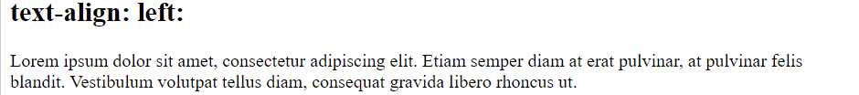

# CSS

<h3>CSS is used to define styles for your web pages, including the design, layout, and variations in display for different devices and screen sizes.</h3>

## CSS Syntax

  
Here,

<li>The selector points to the HTML element you want to style.
<li>The declaration block contains one or more declarations separated by semicolons.
<li>Each declaration includes a CSS property name and a value, separated by a colon.
<li>Multiple CSS declarations are separated with semicolons, and declaration blocks are surrounded by curly braces.

## CSS Selectors

<li>The CSS Universal Selector
<li>The CSS element Selector
<li>The CSS id Selector
<li>The CSS class Selector
<li>The CSS Combination Selector
<li>The CSS Grouping Selector

    

    <h3><ins>HTML Code</ins></h3>
    <pre>
        &lt;body&gt;
        &lt;h1&gt;Hello to CSS&lt;/h1&gt;
        &lt;p&gt;Every paragraph will be affected by the style.&lt;/p&gt;
        &lt;p id="para1"&gt;This is Para 1 id.&lt;/p&gt;
        &lt;p class="center"&gt;This para has center class.&lt;/p&gt;
        &lt;p class="large"&gt;All para with class large will be large&lt;/p&gt;
        &lt;div class="large"&gt;Any other element with class large won't be large..&lt;/div&gt;
        &lt;/body&gt;
    </pre>
    <h3><ins>CSS Code</ins></h3>
    <pre>
    *{
    color: red;
    }
    p {
        background-color: aqua;
    }
    #para1{
        font-family: 'Lucida Sans', 'Lucida Sans Regular', 'Lucida Grande', 'Lucida Sans Unicode', Geneva, Verdana, sans-serif;
    }
    .center{
        text-align: center;
    }
    p.large{
        font-size: 40px;
    }
    h1,div{
        background-color: yellow;
    }
    </pre>
    

    

    <h3><ins>Output</ins></h3>
    

## CSS Backgrounds

    <h3><ins>CSS code</ins></h3>
    <pre>
body{
background-color: pink;
background-image: url(cssimages/sticket.png);
background-repeat: no-repeat;
background-position: right bottom;
background-attachment: fixed;
}
    </pre>
    

<h3><ins>Background Shorthand</ins></h3>

To shorten the code, it is also possible to specify all the background properties in one single property. This is called a shorthand property.

    <table>
        <thead>
            <tr>
            <th>Full Form</th>
            <th>Short Form</th>
            </tr>
        </thead>
        <tbody>
            <tr>
                <td>
                    <pre>
body {
  background-color: #ffffff;
  background-image: url("img_tree.png");
  background-repeat: no-repeat;
  background-position: right top;
}
                    </pre>
                </td>
                <td>
                    <pre>
body {
  background: #ffffff url("img_tree.png") no-repeat right top;
}
                    </pre>
                </td>
            </tr>
        </tbody>
    </table>

## Box Model
<h3><ins>Padding, Border, Outline, Margin</ins></h3>

    <h3><ins>Border Shorthand</ins></h3>
    <table>
        <thead>
            <tr>
            <th>Full Form</th>
            <th>Short Form</th>
            </tr>
        </thead>
        <tbody>
            <tr>
                <td>
                    <pre>
p {
border-width: 5px;
border-style: solid;
border-color: red;
}
                    </pre>
                </td>
                <td>
                    <pre>
p {
border: 5px solid red;
}
                    </pre>
                </td>
            </tr>
        </tbody>
    </table>
    same is applicable for outline.

## CSS dimensions

## CSS Text Alignment/Direction Properties

<h3><ins>direction</ins></h3>
<ul>
<li><b>ltr : </b>This text goes from left to right. This is default.</li>
<li><b>rtl : </b>This text goes from right to left.</li>
</ul>

<h3><ins>text-align</ins></h3>
<table>
    <tr>
        <td><b>left : </b></td>
        <td></td>
    </tr>
    <tr>
        <td><b>right : </b></td>
        <td></td>
    </tr>
    <tr>
        <td><b>center : </b></td>
        <td></td>
    </tr>
    <tr>
        <td><b>justify : </b></td>
        <td></td>
    </tr>
</table>

<h3><ins>text-align-last</ins></h3>
Only the last line is aligned.

<h3><ins>vertical-allignment</ins></h3>

## Text Decoration
<ul>
<li>
<h3><ins>text-decoration-line</ins></h3>

</li>
<li>
<h3>
<ins>text-decoration-color</ins></h3>
</li>
<li>
<h3><ins>text-decoration-style</ins></h3>
<li>double, dotted, dashed, wavy
</li>
<li>
<h3><ins>text-decoration-thickness</ins></h3>
</li>

<li>
<h3><ins>Shorthand</ins></h3>
<pre>
h1 {
  text-decoration: underline;
}
h2 {
  text-decoration: underline red;
}
h3 {
  text-decoration: underline red double;
}
p {
  text-decoration: underline red double 5px;
}
</pre>
</li>
<li>Tip, text-decoration:none; //to hide underline in links..</li>
</ul>

## CSS Font
<h3><ins>CSS Web Safe Fonts</ins></h3>

There are no 100% completely web safe fonts. Therefore, developers always use fallback fonts. In examples below, last 2 fonts are fallback fonts.

<pre>
.p1 {
  font-family: "Times New Roman", Times, serif;
}

.p2 {
  font-family: Arial, Helvetica, sans-serif;
}

.p3 {
  font-family: "Lucida Console", "Courier New", monospace;
}
</pre>

<h3><ins>Responsive font-size with Viewport Width</ins></h3>

    

    <b>Responsive Font Size : </b>The text size can be set with a vw unit, which means the "viewport width". Viewport is the browser window size. 1vw = 1% of viewport width. If the viewport is 50cm wide, 1vw is 0.5cm.
    

    
    

 
<h3><ins>CSS Google Fonts</ins></h3>
<pre>
&lt;head&gt;
&lt;link rel=&quot;stylesheet&quot; href=&quot;https://fonts.googleapis.com/css?family=Sofia&quot;&gt;
&lt;style&gt;
body {
  font-family: &quot;Sofia&quot;, sans-serif;
}
&lt;/style&gt;
&lt;/head&gt;
</pre>

<h3><ins>Shorthand property</ins></h3>
The font property is a shorthand property for:
<ul>
<li>font-style</li>
<li>font-variant (normal/ smal-caps)</li>
<li>font-weight</li>
<li>font-size/line-height</li>
<li>font-family</li>
</ul>
Here, The font-size and font-family values are required. If one of the other values is missing, their default value are used.
<pre>
p.a {
  font: 20px Arial, sans-serif;
}
p.b {
  font: italic small-caps bold 12px/30px Georgia, serif;
}
</pre>

Styling Links
The four links states are:

a:link - a normal, unvisited link
a:visited - a link the user has visited
a:hover - a link when the user mouses over it
a:active - a link the moment it is clicked

Different kind of cursors:
- cursor: auto;
- cursor: default;
- cursor: pointer;
- cursor: wait;
- cursor: text;
- cursor: move;
- cursor: help;
- cursor: not-allowed;
- cursor: none;
- cursor: context-menu;
- cursor: progress;
- cursor: cell;
- cursor: crosshair;
- cursor: vertical-text;
- cursor: alias;
- cursor: copy;
- cursor: no-drop;
- cursor: grab;
- cursor: grabbing;
- cursor: all-scroll;
- cursor: col-resize;
- cursor: row-resize;
- cursor: n-resize;
- cursor: e-resize;
- cursor: s-resize;
- cursor: w-resize;
- cursor: ne-resize;
- cursor: nw-resize;
- cursor: zoom-in;
- cursor: zoom-out;

### Striped Tables
For zebra-striped tables, use the nth-child() selector and add a background-color to all even (or odd) table rows:
tr:nth-child(even) {background-color: #f2f2f2;}

Responsive Table
A responsive table will display a horizontal scroll bar if the screen is too small to display the full content:

## CSS Display Properties
Property Description: Display	Specifies how an element should be displayed
visibility	Specifies whether or not an element should be visible. visibility:hidden - Hides an element.But the element will still take up the same space as before.
Some display properties:
- inline (Displays an element as an inline element)
- block (Displays an element as a block element)
- flex (Displays an element as a block-level flex container)
- grid (Displays an element as a block-level grid container)
- none (The element is completely removed)
display:none vs visibility:hidden
display:none will completely remove the element. The next element will take up its space.
on the other hand,
visibility: hidden will hide the element, but the element will still take up the same space as before

## Using width, max-width and margin: auto;
- Setting the width of a block-level element will prevent it from stretching out to the edges of its container.
- Using max-width instead, will improve the browser's handling of small windows.
- We can set the margins to auto, to horizontally center the element within its container. The element will take up the specified width, and the remaining space will be split equally between the two margins.

## CSS Layout - Position Property
- static: 
    - HTML elements are positioned static by default. Static positioned elements are not affected by the top, bottom, left, and right properties.
- relative
    - An element with position: relative; is positioned relative to its normal position. Setting the top, right, bottom, and left properties of a relatively-positioned element will adjust away from its normal position. Other content will not be adjusted to fit into any gap left by the element.
- absolute
    - An element with position: absolute; is positioned relative to its relatively positioned parent element.
    
- fixed
    - An element with position: fixed; is positioned relative to the viewport, which means it always stays in the same place even if the page is scrolled. 
    - The top, right, bottom, and left properties are used to position the element.
    - A fixed element <b>does not</b> leave a gap in the page where it would normally have been located.
    
- sticky
    - A sticky element toggles between relative and fixed, depending on the scroll position. It is positioned relative until a given offset position is met in the viewport - then it "sticks" in place (like position:fixed).

## CSS Overflow
The overflow property specifies whether to clip the content or to add scrollbars when the content of an element is too big to fit in the specified area.
The overflow property has the following values:

- visible - Default. The overflow is not clipped. The content renders outside the element's box.

- hidden - The overflow is clipped, and the rest of the content will be invisible

- scroll - The overflow is clipped, and a scrollbar is added to see the rest of the content

- auto - Similar to scroll, but it adds scrollbars only when necessary

## CSS Combinators
There are four different combinators in CSS:

- descendant selector (space)
    - Matches all elements that are descendants of a specified element.
    
- child selector (>)
    - Selects all elements children of a specified element.
    
- adjacent sibling selector (+)
    - The adjacent sibling selector is used to select an element that is directly after another specific element.

    - Sibling elements must have the same parent element, and "adjacent" means "immediately following".
- general sibling selector (~)
    - The general sibling selector selects all elements that are next siblings of a specified element.

## CSS Pseudo-classes
A pseudo-class is used to define a special state of an element.
different states of Anchor tag are:
<pre>
/* unvisited link */
a:link {
  color: #FF0000;
}

/* visited link */
a:visited {
  color: #00FF00;
}

/* mouse over link */
a:hover {
  color: #FF00FF;
}

/* selected link */
a:active {
  color: #0000FF;
}
</pre>

