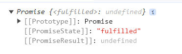

# JavaScript Fundamentals

## Topics
- [Operators](#javascript-operators)
    - [Arithmetic Operators](#javascript-arithmetic-operators)
    - [Logical Operators](#javascript-logical-operators)
    - [Type Operators](#javascript-type-operators)
    - [Bitwise Operators](#javascript-bitwise-operators)
    - [Operators with Strings and Numbers](#operators-with-strings-and-numbers)
    - [Assignment Operators](#javascript-assignment-operators)
    - [Shift Assignment Operators](#shift-assignment-operators)
    - [Bitwise Assignment Operators](#bitwise-assignment-operators)
    - [Logical Assignment Operators](#logical-assignment-operators)
    - [Comparison Operators](#javascript-comparison-operators)

- [Datatypes](#javascript-datatypes)
- [Arrays](#Javascript-arrays)
    - [Creating an Array](#creating-an-array)
    - [Arrays are Objects](#arrays-are-objects)
    - [How to Recognize an Array](#how-to-recognize-an-array)
    - [Array Elements](#array-elements)
    - [Accessing Array Element](#accessing-array-element)
    - [Adding Array Elements](#adding-array-elements)
- [Array Methods](#javascript-array-methods)
    - [Basic Array Methods](#basic-array-methods)
    - [Array join()](#javascript-array-join)
    - [Popping and Pushing](#popping-and-pushing)
    - [Shifting Elements](#shifting-elements)
    - [Merging Arrays](#merging-arrays-concatenating)
    - [copyWithin()](#array-copywithin)
    - [Flattening an Array](#flattening-an-array)
    - [Splicing and Slicing Arrays](#splicing-and-slicing-arrays)
    - [Automatic toString()](#automatic-tostring)

- [Array Searching](#javascript-array-search)
    - [Array indexOf()](#javascript-array-indexof)
    - [Array lastindexOf()](#javascript-array-lastindexof)
    - [Array includes()](#javascript-array-includes)
    - [Array find()](#javascript-array-find)
    - [Array findIndex()](#javascript-array-findindex)
    - [Array findLast()](#javascript-array-findlast-method)
    - [Array findLastIndex()](#javascript-array-findlastindex-method)

- [JavaScript Array Sort](#javascript-array-sort)
    - [Sorting an Array](#sorting-an-array)
    - [Reversing an Array](#reversing-an-array)
    - [Array toSorted() Method](#array-tosorted-method)
    - [Array toReversed() Method](#array-toreversed-method)
    - [Numeric Sort](#numeric-sort)
    - [The Compare Function](#the-compare-function)
    - [Sorting Object Arrays](#sorting-object-arrays)
    - [Stable Array Sort](#stable-array-sort)

- [Array Iteration](#array-iteration-methods)
    - [Array forEach()](#javascript-array-foreach)
    - [Array map()](#javascript-array-map)
    - [Array flatMap](#javascript-array-flatmap)
    - [Array filter()](#javascript-array-filter)
    - [Array reduce()](#javascript-array-reduce)
    - [Array every()](#javascript-array-every)
    - [Array some()](#array-some)
    - [Array keys()](#array-keys)
    - [Array entries()](#array-entries)
    - [Array with()](#array-with-method)
    - [Array Spread()](#array-spread-)
- [JavaScript Events](#javascript-events)
    - [Common HTML Events](#common-html-events)
- [JavaScript Errors](#javascript-errors)
<!-- - [DOM Manipulation](#dom-manipulation)
- [BOM Manipulation](#bom-manipulation) -->
- [JSON](#json)
- [JavaScript Async](#javascript-async)
    - [Callback](#callback)
    - [Callback Hell](#callback-hell)
    - [Promise](#promise)
    - [Promise Chaining](#promise-chaining)
    - [Async-await](#async-await)
    - [Chaining with Async-Await](#chaining-with-async-await)
- [JavaScript Clean Coding](#javascript-clean-coding)
    - [How should we name variables?](#how-should-we-name-variables)
    - [How should we write functions?](#how-should-we-write-functions)
    - [How to write nice async code?](#how-to-write-nice-async-code)


# JavaScript Operators
Javascript operators are used to perform different types of mathematical and logical computations.

## JavaScript Arithmetic Operators

**Arithmetic Operators** are used to perform arithmetic on numbers:


|Operator|Description                 |
|--------|----------------------------|
|+       |Addition                    |
|-       |Subtraction                 |
|*       |Multiplication              |
|**      |Exponentiation (ES2016)     |
|/       |Division                    |
|%       |Modulus (Division Remainder)|
|++      |Increment                   |
|--      |Decrement                   |
## JavaScript Logical Operators


|Operator|Description|
|--------|-----------|
|&&      |logical and|
|\|\|      |logical or |
|!       |logical not|


## JavaScript Type Operators

|Operator  |Description                                               |
|----------|----------------------------------------------------------|
|typeof    |Returns the type of a variable                            |
|instanceof|Returns true if an object is an instance of an object type|


## JavaScript Bitwise Operators

Bit operators work on 32 bits numbers.

Any numeric operand in the operation is converted into a 32 bit number. The result is converted back to a JavaScript number.


|Operator|Description         |Example|Same as     |Result|Decimal|
|--------|--------------------|-------|------------|------|-------|
|&       |AND                 |5 & 1  |0101 & 0001 |0001  | 1     |
|\|      |OR                  |5 \| 1 |0101 \| 0001|0101  | 5     |
|~       |NOT                 |~ 5    | ~0101      |1010  | 10    |
|^       |XOR                 |5 ^ 1  |0101 ^ 0001 |0100  | 4     |
|<<      |left shift          |5 << 1 |0101 << 1   |1010  | 10    |
|>>      |right shift         |5 >> 1 |0101 >> 1   |0010  |  2    |
|>>>     |unsigned right shift|5 >>> 1|0101 >>> 1  |0010  |  2    |


**Note :** The examples above uses 4 bits unsigned examples. But JavaScript uses 32-bit signed numbers.  
Because of this, in JavaScript, ~ 5 will not return 10. It will return -6.  
~00000000000000000000000000000101 will return 11111111111111111111111111111010

JavaScript String Comparison
----------------------------

All the comparison operators above can also be used on strings:

### Example
let text1 = "A";  
let text2 = "B";  
let result = text1 < text2;

Strings are compared alphabetically:

### Example

let text1 = "20";  
let text2 = "5";  
let result = text1 < text2;

JavaScript String Addition
--------------------------

The `+` can also be used to add (concatenate) strings:

### Example
<pre>
let text1 = "John";  
let text2 = "Doe";  
let text3 = text1 + " " + text2; // "John Doe"
</pre>
The `+=` assignment operator can also be used to add (concatenate) strings:

### Example
<pre>
let text1 = "What a very ";  
text1 += "nice day";
</pre>

The result of text1 will be: `What a very nice day`

## Operators with Strings and Numbers
Adding two numbers, will return the sum, but adding a number and a string will return a string:

### Example

let x = 5 + 5;  
let y = "5" + 5;  
let z = "Hello" + 5;  
let w = "5" * 5;

The result of _x_, _y_, _z_ & _w_ will be:

`10`   `55`   `Hello5` 

**Note :** If we add a number and a string, the result will be a string!

## JavaScript Assignment Operators
Assignment operators assign values to JavaScript variables.

The **Addition Assignment Operator** (`+=`) adds a value to a variable.


|Operator|Example|Same As   |
|--------|-------|----------|
|=       |x = y  |x = y     |
|+=      |x += y |x = x + y |
|-=      |x -= y |x = x - y |
|*=      |x *= y |x = x * y |
|/=      |x /= y |x = x / y |
|%=      |x %= y |x = x % y |
|**=     |x **= y|x = x ** y|


## Shift Assignment Operators
|Operator|Example |Same As    |
|--------|--------|-----------|
|<<=     |x <<= y |x = x << y |
|>>=     |x >>= y |x = x >> y |
|>>>=    |x >>>= y|x = x >>> y|

- **The <<= Operator :** The **Left Shift Assignment Operator** left shifts a variable.
    <pre>
    let x = -100; 
    x <<= 1; // x=-200</pre>
- **The >>= Operator :** The **Right Shift Assignment Operator** right shifts a variable (signed).
    <pre>
    let x = -100; 
    x >>= 1; // x=-50</pre>
- **The >>>= Operator :** The **Unsigned Right Shift Assignment Operator** right shifts a variable (unsigned).
    <pre>
    let x = -100; 
    x >>>= 1; // x=2147483598</pre>


## Bitwise Assignment Operators

|Operator|Example |Same As   |
|--------|--------|----------|
|&=      |x &= y  |x = x & y |
|^=      |x ^= y  |x = x ^ y |
|\|=     |x \|= y |x = x \| y|


## Logical Assignment Operators


|Operator|Example   |Same As           |
|--------|----------|------------------|
|&&=     |x &&= y   |x = x && (x = y)  |
|\|\|=   |x \|\|= y |x = x \|\| (x = y)|
|??=     |x ??= y   |x = x ?? (x = y)  |

- **The &&= Operator :** The **Logical AND assignment operator** is used between two values.
    - If the first value is true, the second value is assigned.

- **The ||= Operator :** The **Logical OR assignment operator** is used between two values.
    - If the first value is false, the second value is assigned.

- **The ??= Operator :** The **Nullish coalescing assignment operator** is used between two values.
    - If the first value is undefined or null, the second value is assigned.

<b><a href="https://www.w3schools.com/js/tryit.asp?filename=tryjs_assign_nullish">Demo</a></b>

## JavaScript Comparison Operators


|Operator|Description                      |
|--------|---------------------------------|
|==      |equal to                         |
|===     |equal value and equal type       |
|!=      |not equal                        |
|!==     |not equal value or not equal type|
|>       |greater than                     |
|<       |less than                        |
|>=      |greater than or equal to         |
|<=      |less than or equal to            |
|?       |ternary operator                 |

# JavaScript Datatypes
## JavaScript has 8 Datatypes
* String
* Number
* Bigint
* Boolean
* Undefined
* Null
* Symbol
* Object

## The Object Datatype
The object data type can contain both built-in objects, and user defined objects:</br>
**Built-in object types can be :** objects, arrays, dates, maps, sets, intarrays, floatarrays, promises, and more.

# JavaScript Arrays

An array is a special variable, which can hold more than one value:

const cars = \["Saab", "Volvo", "BMW"\];

## Creating an Array

* Using an array literal \[ \] is the easiest way to create a JavaScript Array.
* Another way is using the JavaScript Keyword `new`

These two different statements both create a new array containing 6 numbers:
```js
const points = new Array(40, 100, 1, 5, 25, 10);  
const points = [40, 100, 1, 5, 25, 10];
```

But the `new` keyword can produce some unexpected results:
```js
// Create an array with three elements:  
const points = new Array(40, 100, 1); //[40, 100, 1]

// Create an array with two elements:  
const points = new Array(40, 100); //[40,100]

// Create an array with one element ???  
const points = new Array(40);  // ,,,,,,,,,,,,,,,,,,,,,,,,,,,,,,,,,,,,,,,
```
[Demo »](https://www.w3schools.com/js/tryit.asp?filename=tryjs_array_new_error)

`const points = [40];` is not the same as: `const points = new Array(40);`

`const points = new Array(40);` Creates an array with 40 undefined elements.

So, For simplicity, readability and execution speed, use the array literal method.


## Arrays are Objects

Arrays are a special type of objects. The `typeof` operator in JavaScript returns "object" for arrays.

But, JavaScript arrays are best described as arrays.

Arrays use **numbers** to access its "elements". In this example, `person[0]` returns John:

Objects use **names** to access its "members". In this example, `person.firstName` returns John:

## How to Recognize an Array

A common question is: How do I know if a variable is an array?

The problem is that the JavaScript operator `typeof` returns "`object`":

```js
const fruits = ["Banana", "Orange", "Apple"];  
let type = typeof fruits;
```

The typeof operator returns object because a JavaScript array is an object.

* **Solution 1:** `Array.isArray()` method
* **Solution 2:**`instanceof` operator returns true if an object is created by a given constructor:

```js
const fruits = ["Banana", "Orange", "Apple"];
(fruits instanceof Array);
```


## Array Elements 

JavaScript variables can be objects. Arrays are special kinds of objects.

Because of this, we can have variables of different types in the same Array.

**Array Elements can be object, function or another array.**

myArray\[0\] = Date.now;  
myArray\[1\] = myFunction;  
myArray\[2\] = myCars;


## Array Properties and Methods
----------------------------
cars.length   // Returns the number of elements  
cars.sort()   // Sorts the array


## Accessing Array Element

First element: 

```js
const fruits = ["Banana", "Orange", "Apple", "Mango"];  
let fruit = fruits[0];
```

Last element:

```js
const fruits = ["Banana", "Orange", "Apple", "Mango"];  
let fruit = fruits[fruits.length - 1];
```

## Adding Array Elements

* Using `push()` method:
```js
const fruits = ["Banana", "Orange", "Apple"];  
fruits.push("Lemon");  // Adds a new element (Lemon) to fruits
```
* Using the `length` property:
```js
const fruits = ["Banana", "Orange", "Apple"];  
fruits[fruits.length] = "Lemon";  // Adds "Lemon" to fruits
```
<mark>**WARNING !**</mark>  Adding elements with high indexes can create undefined "holes" in an array:

**Example**
```js
const fruits = ["Banana", "Orange", "Apple"];  
fruits[6] = "Lemon";  // Creates undefined "holes" in fruits
```
**output** 
`Banana,
Orange,
Apple,
undefined,
undefined,
undefined,
Lemon`

# JavaScript Array Methods


## Basic Array Methods

* **JavaScript Array length :** The `length` property returns the length (size) of an array:

* **JavaScript Array toString() :** The JavaScript method `toString()` converts an array to a string of (comma separated) array values.
    ```js
    const fruits = ["Banana", "Orange", "Apple", "Mango"];  
    ```
    Result: `Banana,Orange,Apple,Mango`  

* **JavaScript Array at() :** [ES2022](https://www.w3schools.com/js/js_2022.asp) intoduced the array method `at()`:

    Get the third element of fruits using at():
    ```js
    const fruits = ["Banana", "Orange", "Apple", "Mango"];  
    let fruit = fruits.at(2); //Apple
    let anotherFruit = fruits(-1) //Mango
    ```
    The `at()` method returns the same as `[]`.

    <mark>**Note :**</mark> Many languages allows `negative bracket indexing` like \[-1\] to access elements from the end of an object/ array/ string.

    This is not possible in JavaScript, because \[ \] is used for accessing both arrays and objects. obj\[-1\] refers to the value of key -1, not to the last property of the object.

    **The `at()` method was introduced in ES2022 to solve this problem.**

## JavaScript Array join()

The `join()` method also joins all array elements into a string.

It behaves just like `toString()`, but in addition we can specify the separator:
```js
const fruits = ["Banana", "Orange", "Apple", "Mango"];  
document.getElementById("demo").innerHTML = fruits.join(" \* ");
```
Result: `Banana \* Orange \* Apple \* Mango`

## Popping and Pushing
Popping items **out** of an array, or pushing items **into** an array.

* **JavaScript Array pop() :** The `pop()` method returns the last element and removes it from the array:
    ```js
    const fruits = ["Banana", "Orange", "Apple", "Mango"];  
    let lastFruit = fruits.pop(); //Mango
    ```
    The `pop()` method returns the value that was "popped out":


* **JavaScript Array push() :** The `push()` method adds a new element to an array (at the end):

    ```js
    const fruits = ["Banana", "Orange", "Apple", "Mango"];  
    let len = fruits.push("Kiwi"); \\5
    ```
    The `push()` method returns the new array length:

[Demo »](https://www.w3schools.com/js/tryit.asp?filename=tryjs_array_push_length)


## Shifting Elements

Shifting is equivalent to popping, but working on the first element instead of the last.

* **JavaScript Array shift() :** The `shift()` method returns the first array element, removes it and "shifts" all other elements to a lower index.
    ```js
    const fruits = ["Banana", "Orange", "Apple", "Mango"];  
    let fruit = fruits.shift();
    The `shift()` method returns the value that was "shifted out":
    ```

* **JavaScript Array unshift() :** The `unshift()` method adds a new element to an array (at the beginning), and "unshifts" older elements:
    ```js
    const fruits = ["Banana", "Orange", "Apple", "Mango"];  
    fruits.unshift("Lemon");
    ```
    The `unshift()` method returns the new array length:

    [Demo »](https://www.w3schools.com/js/tryit.asp?filename=tryjs_array_unshift_return)


## Merging Arrays (Concatenating)

In programming languages, concatenation means joining strings end-to-end.

Concatenation "snow" and "ball" gives "snowball".

Concatenating arrays means joining arrays end-to-end.

- **JavaScript Array concat() :** The `concat()` method creates a new array by merging (concatenating) existing arrays:

    ```js
    const myGirls = ["Cecilie", "Lone"];  
    const myBoys = ["Emil", "Tobias", "Linus"];

    const myChildren = myGirls.concat(myBoys); \\["Cecilie", "Lone", "Emil", "Tobias", "Linus"];
    ```

    **Note:** The `concat()` method does not change the existing arrays. It always returns a new array.

- The `concat()` method can take any number of array arguments.

    ```js
    const arr1 = ["Cecilie", "Lone"];  
    const arr2 = ["Emil", "Tobias", "Linus"];  
    const arr3 = ["Robin", "Morgan"];  
    const myChildren = arr1.concat(arr2, arr3);
    ```

- The `concat()` method can also take single value as arguments:
    ```js
    const arr1 = \["Emil", "Tobias", "Linus"\];  
    const myChildren = arr1.concat("Peter"); 
    ```

## Array copyWithin()

The `copyWithin()` method copies array elements to another position in an array:


- Copy to index 2, all elements from index 0:
    ```js
    const fruits = ["Banana", "Orange", "Apple", "Mango"];  
    fruits.copyWithin(2, 0); \\["Banana", "Orange", "Banana", "Mango"]
    ```
- Copy to index 2, the elements from index 0 to 2:
    ```js
    const fruits = ["Banana", "Orange", "Apple", "Mango", "Kiwi"];  
    fruits.copyWithin(2, 0, 2);
    ```
    **Result :** `Banana,Orange,Banana,Orange,Kiwi,Papaya`

[Demo »](https://www.w3schools.com/js/tryit.asp?filename=tryjs_array_copywithin2)

**Note**
- The `copyWithin()` method overwrites the existing values.

- The `copyWithin()` method does not add items to the array.

- The `copyWithin()` method does not change the length of the array.


## Flattening an Array

Flattening an array is the process of reducing the dimensionality of an array. Flattening is useful when we want to convert a multi-dimensional array into a one-dimensional array.

* **JavaScript Array flat() :** The `flat()` method creates a new array with sub-array elements concatenated to a specified depth.
    ```js
    const myArr = [[1,2],[3,4],[5,6]];  
    const newArr = myArr.flat();
    ```
    Result: `1,2,3,4,5,6`

    [Demo »](https://www.w3schools.com/js/tryit.asp?filename=tryjs_array_flat)

* **JavaScript Array flatMap() :** The `flatMap()` method first maps all elements of an array and then creates a new array by flattening the array.

    ```js
    const myArr = [1, 2, 3, 4, 5, 6];  
    const newArr = myArr.flatMap(x => [x, x * 10]);
    ```
    **Result:** `1,10,2,20,3,30,4,40,5,50,6,60`

    [Demo »](https://www.w3schools.com/js/tryit.asp?filename=tryjs_array_flatmap)


## Splicing and Slicing Arrays

* **JavaScript Array splice() :** The `splice()` method adds new items to an array.

    ```js
    const fruits = ["Banana", "Orange", "Apple", "Mango"];  
    fruits.splice(2, 0, "Lemon", "Kiwi");
    ```
    Results: `"Banana", "Orange", "Lemon", "Kiwi","Apple", "Mango"`
    - The first parameter (2) defines the position **where** new elements should be **added** (spliced in).

    - The second parameter (0) defines **how many** elements should be **removed**.

    - The rest of the parameters ("Lemon" , "Kiwi") define the new elements to be **added**.

    - The `splice()` method returns an array with the deleted items.

        ```js
        const fruits = ["Banana", "Orange", "Apple", "Mango"];  
        fruits.splice(2, 2, "Lemon", "Kiwi");
        ```
        Results: `"Banana", "Orange", "Lemon", "Kiwi"`
    
    - Using splice() to Remove Elements

        ```js
        const fruits = ["Banana", "Orange", "Apple", "Mango"];  
        fruits.splice(2, 1);
        ```
        Result: `"Banana", "Orange", "Mango"`

        Here, the first parameter (2) defines the position where new elements should be **added** (spliced in).

        The second parameter (1) defines **how many** elements should be **removed** from that position.

        The rest of the parameters are omitted. No new elements will be added.

    [Demo »](https://www.w3schools.com/js/tryit.asp?filename=tryjs_array_splice_return)

* **JavaScript Array toSpliced() :** [ES2023](https://www.w3schools.com/js/js_2023.asp) added the Array toSpliced() method as a safe way to splice an array without altering the original array.

    The difference between the new **toSpliced()** method and the old **splice()** method is that the new method creates a new array, keeping the original array unchanged, while the old method altered the original array.
    ```js
    const months = ["Jan", "Feb", "Mar", "Apr"];  
    const spliced = months.toSpliced(0, 1);
    ```
    Result: `spliced = ["Feb", "Mar", "Apr"]`

* **JavaScript Array slice() :** The `slice()`* method slices out a piece of an array.
    ```js
    const fruits = ["Banana", "Orange", "Lemon", "Apple", "Mango"];  
    const citrus = fruits.slice(1);
    ```
    Result: Slice out a part of an array starting from array element 1. `"Orange", "Lemon", "Apple", "Mango"`


    -   The `slice()` method creates a new array.

    -   The `slice()` method does not remove any elements from the source array.

    -   The `slice()` method can take two arguments like `slice(1, 3)`. The method then selects elements from the start argument, and up to (but not including) the end argument.
        ```js
        const fruits = ["Banana", "Orange", "Lemon", "Apple", "Mango"];  
        const citrus = fruits.slice(1, 3);
        ```
        Results: `"Orange", "Lemon"`

    - If the end argument is omitted, like in the first examples, the `slice()` method slices out the rest of the array.

    [Demo »](https://www.w3schools.com/js/tryit.asp?filename=tryjs_array_slice2)


## Automatic toString()

JavaScript automatically converts an array to a comma separated string when a primitive value is expected.

These two examples will produce the same result:

```js
const fruits = ["Banana", "Orange", "Apple", "Mango"];  
document.getElementById("demo").innerHTML = fruits.toString();
```
```js
const fruits = ["Banana", "Orange", "Apple", "Mango"];  
document.getElementById("demo").innerHTML = fruits;
```
[Demo »](https://www.w3schools.com/js/tryit.asp?filename=tryjs_array_automatic)

<mark>**Note**</mark> All JavaScript objects have a toString() method.

# JavaScript Array Search

## JavaScript Array indexOf() 
The `indexOf()` method searches an array for an element value and returns its position.

Search an array for the item "Apple":
```js
const fruits = \["Apple", "Orange", "Apple", "Mango"\];  
let position = fruits.indexOf("Apple") + 1;
```
- **Syntax :** _array_.indexOf(_item_, _start_)
-   item: start 
-   Required. The item to search for.: Optional. Where to start the search. 
-   Negative values will start at the given position counting from the end, and search to the end.
- `Array.indexOf()` returns -1 if the item is not found.

-   If the item is present more than once, it returns the position of the first occurrence.


## JavaScript Array lastIndexOf()
`Array.lastIndexOf()` is the same as `Array.indexOf()`, but returns the position of the last occurrence of the specified element.


## JavaScript Array includes()
 `Array.includes()` allows us to check if an element is present in an array (including NaN, unlike indexOf).
```js
const fruits = ["Banana", "Orange", "Apple", "Mango"];
fruits.includes("Mango"); // is true
```

## JavaScript Array find()

The `find()` method returns the value of the first array element that passes a test function.

This example finds (returns the value of) the first element that is larger than 18:

```js
const numbers = \[4, 9, 16, 25, 29\];  
let first = numbers.find(myFunction); //25

function myFunction(value, index, array) {  
  return value > 18;  
}
```

[Demo »](https://www.w3schools.com/js/tryit.asp?filename=tryjs_array_find)

Note that the function takes 3 arguments:

*   The item value
*   The item index
*   The array itself

## JavaScript Array findIndex()

The `findIndex()` method returns the index of the first array element that passes a test function.

This example finds the index of the first element that is larger than 18:

```js
const numbers = \[4, 9, 16, 25, 29\];  
let first = numbers.findIndex(myFunction); //3

function myFunction(value, index, array) {  
  return value > 18;  
}
```
## JavaScript Array findLast() Method
findLast() method will start from the end of an array and return the value of the first element that satisfies a condition.

```js
const temp = \[27, 28, 30, 40, 42, 35, 30\];  
let high = temp.findLast(x => x > 40);
```

## JavaScript Array findLastIndex() Method
The findLastIndex() method finds the index of the last element that satisfies a condition.
```js
const temp = [27, 28, 30, 40, 42, 35, 30];  
let pos = temp.findLastIndex(x => x > 40);
```
# JavaScript Array Sort
## Sorting an Array
The `sort()` method sorts an array alphabetically:

```js
const fruits = ["Banana", "Orange", "Apple", "Mango"];  
fruits.sort();
```

Result: `Apple,Banana,Mango,Orange`

## Reversing an Array
The `reverse()` method reverses the elements in an array:

```js
const fruits = ["Banana", "Orange", "Apple", "Mango"];  
fruits.reverse();
```
Result: `Mango,Apple,Orange,Banana`

By combining `sort()` and `reverse()`, we can sort an array in descending order:

## Array toSorted() Method

[ES2023](https://www.w3schools.com/js/js_2023.asp) added the `toSorted()` method as a safe way to sort an array without altering the original array.

The difference between `toSorted()` and `sort()` is that the first method creates a new array, keeping the original array unchanged, while the last method alters the original array.
```js
const months = ["Jan", "Feb", "Mar", "Apr"];  
const sorted = months.toSorted();
```
## Array toReversed() Method

[ES2023](https://www.w3schools.com/js/js_2023.asp) added the `toReversed()` method as a safe way to reverse an array without altering the original array.

The difference between `toReversed()` and `reverse()` is that the first method creates a new array, keeping the original array unchanged, while the last method alters the original array.

```js
const months = \["Jan", "Feb", "Mar", "Apr"\];  
const reversed = months.toReversed();
```
## Numeric Sort

By default, the `sort()` function sorts values as **strings**.

This works well for strings ("Apple" comes before "Banana").

If numbers are sorted as strings, "25" is bigger than "100", because "2" is bigger than "1".

Because of this, the `sort()` method will produce incorrect result when sorting numbers.

we can fix this by providing a **compare function**:
```js
const points = [40, 100, 1, 5, 25, 10];  
points.sort(function(a, b){return a - b});
```

Use the same trick to sort an array descending:
```js
const points = [40, 100, 1, 5, 25, 10];  
points.sort(function(a, b){return b - a});
```
[Demo »](https://www.w3schools.com/js/tryit.asp?filename=tryjs_array_sort2)

## The Compare Function

The purpose of the compare function is to define an alternative sort order.

The compare function should return a negative, zero, or positive value, depending on the arguments:

`function(a, b){return a - b}`

When the `sort()` function compares two values, it sends the values to the compare function, and sorts the values according to the returned (negative, zero, positive) value.

If the result is negative, `a` is sorted before `b`.

If the result is positive, `b` is sorted before `a`.

If the result is 0, no changes are done with the sort order of the two values.

[Demo »](https://www.w3schools.com/js/tryit.asp?filename=tryjs_array_sort_alpha)


## Sorting Object Arrays

JavaScript arrays often contain objects:
```js
const cars = [  
  {type:"Volvo", year:2016},  
  {type:"Saab", year:2001},  
  {type:"BMW", year:2010}  
];
```
Even if objects have properties of different data types, the `sort()` method can be used to sort the array.

**The solution is to write a compare function to compare the property values:**

Comparing string properties is a little more complex:
```js
cars.sort(function(a, b){  
  let x = a.type.toLowerCase();  
  let y = b.type.toLowerCase();  
  if (x < y) {return -1;}  
  if (x > y) {return 1;}  
  return 0;  
});
```
[Demo »](https://www.w3schools.com/js/tryit.asp?filename=tryjs_array_sort_object2)


## Stable Array sort()
When sorting elements on a value, the elements must keep their relative position to other elements with the same value.

const myArr = \[  
  {name:"X00",price:100 },  
  {name:"X01",price:100 },  
  {name:"X02",price:100 },  
  {name:"X03",price:100 },  
  {name:"X04",price:110 },  
  {name:"X05",price:110 },  
  {name:"X06",price:110 },  
  {name:"X07",price:110 }  
\];

In the example above, when sorting on price, the result is not allowed to come out with the names in an other relative position like this:

X01 100  
X03 100  
X00 100  
X03 100  
X05 110  
X04 110  
X06 110  
X07 110  
[Demo »](https://www.w3schools.com/js/tryit.asp?filename=tryjs_array_stable_sort)

# Array Iteration Methods
- Array forEach
- Array map()
- Array flatMap()
- Array filter()
- Array reduce()
- Array reduceRight()
- Array some()
- Array from()
- Array keys()
- Array entries()
- Array with()
- Array Spread (...)

Array iteration methods operate on every array item:

## JavaScript Array forEach()
The `forEach()` method calls a function (a callback function) once for each array element.
<pre>
const numbers = [45, 4, 9, 16, 25];  
let txt = "";  
numbers.forEach(myFunction);

function myFunction(value, index, array) {  
  txt += value + "&lt;br&gt;";  
}
</pre>
[Demo »](https://www.w3schools.com/js/tryit.asp?filename=tryjs_array_foreach)

Note that the function takes 3 arguments:

*   The item value
*   The item index
*   The array itself

The example above uses only the value parameter. The example can be rewritten to:

<pre>
const numbers = [45, 4, 9, 16, 25];  
let txt = "";  
numbers.forEach(myFunction);

function myFunction(value) {  
  txt += value + "&lt;br&gt;";  
}
</pre>

## JavaScript Array map()
The `map()` method creates a new array by performing a function on each array element.

The `map()` method does not execute the function for array elements without values.

The `map()` method does not change the original array.

This example multiplies each array value by 2:

```js
const numbers1 = [45, 4, 9, 16, 25];  
const numbers2 = numbers1.map(myFunction);

function myFunction(value, index, array) {  
  return value \* 2;  
}
```

When a callback function uses only the value parameter, the index and array parameters can be omitted:

```js
const numbers1 = [45, 4, 9, 16, 25];  
const numbers2 = numbers1.map(myFunction);

function myFunction(value) {  
  return value \* 2;  
}
```
[Demo »](https://www.w3schools.com/js/tryit.asp?filename=tryjs_array_map_2)

## JavaScript Array flatMap()
The `flatMap()` method first maps all elements of an array and then creates a new array by flattening the array.

```js
const myArr = [1, 2, 3, 4, 5, 6];  
const newArr = myArr.flatMap( x => [x, x * 10]);
```
Result: `1,10,2,20,3,30,4,40,5,50,6,60`

[Demo »](https://www.w3schools.com/js/tryit.asp?filename=tryjs_array_flatmap)


## JavaScript Array filter()
The `filter()` method creates a new array with array elements that pass a test.

This example creates a new array from elements with a value larger than 18:

```js
const numbers = [45, 4, 9, 16, 25];  
const over10 = numbers.filter(x=> x>10);
const over18 = numbers.filter(myFunction);

function myFunction(value, index, array) {  
  return value > 18;  
}
```
[Demo »](https://www.w3schools.com/js/tryit.asp?filename=tryjs_array_filter)


## JavaScript Array reduce()

The `reduce()` method runs a function on each array element to produce (reduce it to) a single value.

The `reduce()` method works from left-to-right in the array. See also `reduceRight()`.

The `reduce()` method does not reduce the original array.

This example finds the sum of all numbers in an array:

```js
const numbers = [45, 4, 9, 16, 25];  
let sum = numbers.reduce(myFunction);
function myFunction(total, value, index, array) {  
  return total + value;  
}
```
Note that the function takes 4 arguments:

*   The total (the initial value / previously returned value)
*   The item value
*   The item index
*   The array itself

The `reduce()` method can accept an initial value:
```js
const numbers = [45, 4, 9, 16, 25];  
let sum = numbers.reduce(myFunction, 100);

function myFunction(total, value) {  
  return total + value;  
}
```
can be done in one line,
```js
const numbers = [45, 4, 9, 16, 25];
let sum = numbers.reduce((total, x)=> total+x, 10);
```
[Demo »](https://www.w3schools.com/js/tryit.asp?filename=tryjs_array_reduce_initial)

## JavaScript Array every()
The `every()` method checks if all array values pass a test.

This example checks if all array values are larger than 18:
```js
const numbers = [45, 4, 9, 16, 25];  
let allOver18 = numbers.every(myFunction);

function myFunction(value, index, array) {  
  return value > 18;  
}
```
[Demo »](https://www.w3schools.com/js/tryit.asp?filename=tryjs_array_every)

Note that the function takes 3 arguments:

*   The item value
*   The item index
*   The array itself

When a callback function uses the first parameter only (value), the other parameters can be omitted:

```js
const numbers = \[45, 4, 9, 16, 25\];  
let allOver18 = numbers.every(myFunction);

function myFunction(value) {  
  return value > 18;  
}
```
[Demo »](https://www.w3schools.com/js/tryit.asp?filename=tryjs_array_every_2)

## Array some()

The `some()` method checks if some array values pass a test.

This example checks if some array values are larger than 18:


```js
const numbers = [45, 4, 9, 16, 25];  
let someOver18 = numbers.some(myFunction);

function myFunction(value, index, array) {  
  return value > 18;  
}
```
[Demo »](https://www.w3schools.com/js/tryit.asp?filename=tryjs_array_some)


## Array keys()

The `Array.keys()` method returns an Array Iterator object with the keys of an array.

Create an Array Iterator object, containing the keys of the array:
```js
const fruits = ["Banana", "Orange", "Apple", "Mango"];  
const keys = fruits.keys();  \\0,1,2,3

```
[Demo »](https://www.w3schools.com/js/tryit.asp?filename=tryjs_array_keys)


## Array entries()

Create an Array Iterator, and then iterate over the key/value pairs:
```js
const fruits = ["Banana", "Orange", "Apple", "Mango"];  
const f = fruits.entries();
```

The `entries()` method returns an Array Iterator object with key/value pairs:

\[0, "Banana"\]  
\[1, "Orange"\]  
\[2, "Apple"\]  
\[3, "Mango"\]

[Demo »](https://www.w3schools.com/js/tryit.asp?filename=tryjs_entries)


## Array with() Method
[ES2023](https://www.w3schools.com/js/js_2023.asp) added the Array with() method as a safe way to update elements in an array without altering the original array.
```js
const months = \["Januar", "Februar", "Mar", "April"\];  
const myMonths = months.with(2, "March");
```
[Demo »](https://www.w3schools.com/js/tryit.asp?filename=tryjs_array_with)

## Array Spread (...)

The ... operator expands an iterable (like an array) into more elements:
```js
const q1 = ["Jan", "Feb", "Mar"];  
const q2 = ["Apr", "May", "Jun"];  
const q3 = ["Jul", "Aug", "Sep"];  
const q4 = ["Oct", "Nov", "May"];

const year = [...q1, ...q2, ...q3, ...q4];
```
[Demo »](https://www.w3schools.com/js/tryit.asp?filename=tryjs_oper_spread_year)


# JavaScript Events


HTML events are **"things"** that happen to HTML elements.

When JavaScript is used in HTML pages, JavaScript can **"react"** on these events.

Often, when events happen, we may want to do something.

JavaScript lets we execute code when events are detected.

HTML allows event handler attributes, **with JavaScript code**, to be added to HTML elements.


## Common HTML Events

Here is a list of some common HTML events:


|Event      |Description                                       |
|-----------|--------------------------------------------------|
|onchange   |An HTML element has been changed                  |
|onclick    |The user clicks an HTML element                   |
|onmouseover|The user moves the mouse over an HTML element     |
|onmouseout |The user moves the mouse away from an HTML element|
|onkeydown  |The user pushes a keyboard key                    |
|onload     |The browser has finished loading the page         |

# JavaScript Errors Try - Catch - Throw

## Throw, and Try...Catch...Finally

- The `try` statement defines a code block to run (to try).
- The `catch` statement defines a code block to handle any error.
- The `finally` statement defines a code block to run regardless of the result.
- The `throw` statement defines a custom error.

## JavaScript try and catch

The `try` statement allows to define a block of code to be tested for errors while it is being executed.

The `catch` statement allows to define a block of code to be executed, if an error occurs in the try block.

**The JavaScript statements `try` and `catch` come in pairs:**
```js
try {  
  //Block of code to try  
}  
catch(_err_) {  
  //Block of code to handle errors  
}
```

## JavaScript Throws Errors

When an error occurs, JavaScript will normally stop and generate an error message.

The technical term for this is: JavaScript will **throw an exception (throw an error)**.

JavaScript will actually create an **Error object** with two properties: **name** and **message**.

## The throw Statement

The `throw` statement allows us to create a custom error.

Technically we can **throw an exception (throw an error)**.

The exception can be a JavaScript `String`, a `Number`, a `Boolean` or an `Object`:

```js
throw "Too big";    // throw a text  
throw 500;          // throw a number
```
If we use `throw` together with `try` and `catch`, we can control program flow and generate custom error messages.

```js
function myFunction() {    
  let x = document.getElementById("demo").value;  
  try {  
    if(x.trim() == "") throw "empty";  
    if(isNaN(x)) throw "not a number";  
    x = Number(x);  
    if(x < 5) throw "too low";  
    if(x > 10) throw "too high";  
  }  
  catch(err) {  
    console.log("Input is " + err);  
  }  
}
```
[Demo »](https://www.w3schools.com/js/tryit.asp?filename=tryjs_throw_error)

## The finally Statement

The `finally` statement lets us execute code, after try and catch, regardless of the result:

```js
try {  
  _Block of code to try  
_}  
catch(_err_) {  
  _Block of code to handle errors  
_}  
finally {  
  _Block of code to be executed regardless of the try / catch result  
_}
```
[Demo »](https://www.w3schools.com/js/tryit.asp?filename=tryjs_finally_error)

## The Error Object

JavaScript has a built in error object that provides error information when an error occurs.

The error object provides two useful properties: **name and message.**

|Property|Description                                |
|--------|-------------------------------------------|
|name    |Sets or returns an error name              |
|message |Sets or returns an error message (a string)|

## Error Name Values

Six different values can be returned by the error name property:


|Error Name    |Description                                 |
|--------------|--------------------------------------------|
|EvalError     |An error has occurred in the eval() function|
|RangeError    |A number "out of range" has occurred        |
|ReferenceError|An illegal reference has occurred (use a variable that has not been declared)          |
|SyntaxError   |A syntax error has occurred                 |
|TypeError     |A type error has occurred                   |
|URIError      |An error in encodeURI() has occurred        |


The six different values are described below.

- **Eval Error :** An `EvalError` indicates an error in the eval() function. (Newer versions of JavaScript do not throw EvalError. Use SyntaxError instead.)

- **Range Error :** A `RangeError` is thrown if we use a number that is outside the range of legal values.

    For example: we cannot set the number of significant digits of a number to 500.
    ```js
    let num = 1;  
    try {  
      num.toPrecision(500);   // A number cannot have 500 significant digits  
    }  
    catch(err) {  
      document.getElementById("demo").innerHTML = err.name;  
    }
    ```
    [Demo »](https://www.w3schools.com/js/tryit.asp?filename=tryjs_error_rangeerror)

- **Reference Error :** A `ReferenceError` is thrown if we use (reference) a variable that has not been declared:

    ```js
    let x = 5;  
    try {  
      x = y + 1;   // y cannot be used (referenced)  
    }  
    catch(err) {  
      document.getElementById("demo").innerHTML = err.name;  
    }
    ```
    [Demo »](https://www.w3schools.com/js/tryit.asp?filename=tryjs_error_referenceerror)

- **Syntax Error :** A `SyntaxError` is thrown if we try to evaluate code with a syntax error.
    ```js
    try {  
      eval("alert('Hello)");   // Missing ' will produce an error  
    }  
    catch(err) {  
      document.getElementById("demo").innerHTML = err.name;  
    }
    ```
    [Demo »](https://www.w3schools.com/js/tryit.asp?filename=tryjs_error_syntaxerror)

- **Type Error :** A `TypeError` is thrown if an operand or argument is incompatible with the type expected by an operator or function.

    ```js
    let num = 1;  
    try {  
      num.toUpperCase();   // we cannot convert a number to upper case  
    }  
    catch(err) {  
      document.getElementById("demo").innerHTML = err.name;  
    }
    ```

    [Demo »](https://www.w3schools.com/js/tryit.asp?filename=tryjs_error_typeerror)

<!-- # DOM Manipulation
hello
# BOM Manipulation
# DOM vs BOM -->
# JSON
- JSON stands for **JavaScript Object Notation**
- JSON is a text format for storing and transporting data
- JSON is "self-describing" and easy to understand

**Why Use JSON?**

- JSON is primarily used to send and receive data between a client and a server in web applications.
- It is often used in APIs and web services to transfer data because it is:
- Text-based and easy to work with.
- Lightweight and faster compared to XML.
- Widely supported by various languages and tools.

**Valid Data Types**

In JSON, values must be one of the following data types:
- a string
- a number
- an object (JSON object)
- an array
- a boolean
- null

**JSON.parse()**

- A common use of JSON is to exchange data to/from a web server.
- When receiving data from a web server, the data is always a string.
- Parse the data with `JSON.parse()`, and the data becomes a JavaScript object.

- Use the JavaScript function `JSON.parse()` to convert text into a JavaScript object:
```js
const obj = JSON.parse('{"name":"John", "age":30, "city":"New York"}');
```
Make sure the text is in JSON format, or else you will get a syntax error.

- **Array as JSON: ** When using the `JSON.parse()` on a JSON derived from an array, the method will return a JavaScript array, instead of a JavaScript object.
```js
const text = '["Ford", "BMW", "Audi", "Fiat"]';  
const myArr = JSON.parse(text);  
console.log(myArr[0]); // Ford
```
[Demo »](https://www.w3schools.com/js/tryit.asp?filename=tryjson_parse_array)

**JSON.stringify()**

- A common use of JSON is to exchange data to/from a web server.

- When sending data to a web server, the data has to be a string.

- Convert a JavaScript object into a string with `JSON.stringify()`.

    ```js
    const obj = {name: "John", age: 30, city: "New York"};
    ```
    Use the JavaScript function `JSON.stringify()` to convert it into a string.

    ```js
    const myJSON = JSON.stringify(obj);
    ```
The result will be a string following the JSON notation.

`myJSON` is now a string, and ready to be sent to a server:

# JavaScript Async
**Synchronous :** Synchronous means the code runs in a particular sequence of instructions given in the program.
Each instruction waits for the previous instruction to complete its execution.<br>
**Asyncronous :** Due to synchronous programming, sometimes imp instructions get
blocked due to some previous instructions, which causes a delay in the UI.
Asynchronous code execution allows to execute next instructions
immediately and doesn't block the flow.

- By default, JavaScript is a synchronous, single threaded programming language. This means that instructions can only run one after another, and not in parallel. Consider the little code snippet below:
    ```js
    console.log("one");
    console.log("two");
    console.log("three");
    ```
    **Output:**
    ```js
    one
    two
    three
    ```
- JavaScript is single-threaded, but can handle asynchronous tasks.
    ```js
    console.log("one");
    setTimeout(()=>{
        console.log("two");}, 2000);
    console.log("three");
    ```
    **Output:**
    ```js
    one
    three
    two
    ```
- Asynchronous programming allows code to run without blocking the main thread.
- Common use cases: Fetching data from APIs, timers, event handling.

## Callback
A callback is a function that is passed inside another function, and then called in that function to perform a task.
```js
function fetchData(callback) {
    setTimeout(() => {
      callback("Data fetched!");
    }, 2000); // Simulate a 2-second data fetching process
  }
  
fetchData((message) => {
    console.log(message); // "Data fetched!"
});
```
This method was very efficient, but only to a certain point. Sometimes, developers have to make multiple calls to different sources in their code. In order to make these calls, callbacks are being nested until they become very hard to read or maintain. This is referred to as **Callback Hell**.
### Callback Hell
Callback hell occurs when callbacks are nested within other callbacks, making the code difficult to read and maintain.
Deep nesting makes it hard to follow the flow of the program and harder to debug.
```js
function fetchData1(callback1) {
  setTimeout(() => {
    console.log("Data 1 fetched");
    callback1();
  }, 1000);
}

function fetchData2(callback2) {
  setTimeout(() => {
    console.log("Data 2 fetched");
    callback2();
  }, 1000);
}

fetchData1(() => {
  fetchData2(() => {
    console.log("All data fetched");
  });
});
```
**Output:**
```
Data 1 fetched
Data 2 fetched
All data fetched
```
Each function fetches data, but because they are nested, the code becomes harder to maintain.

## Promise
Promise is for “eventual” completion of task. It is an object in JS. It is a solution to callback hell.

`let promise = new Promise( (resolve, reject) => { .... } )`

A JavaScript Promise object can be:

- Pending : the result is undefined
- Resolved : the result is a value (fulfilled)
- Rejected : the result is an error object

resolve( result ), reject( error )
```js
const myPromise = new Promise((resolve, reject) => {
  const success = true;
    if (success) {
      resolve("Promise fulfilled!");
    } else {
      reject("Promise rejected!");
    }
});

myPromise
  .then((message) => {
    console.log(message); // "Promise fulfilled!"
  })
  .catch((error) => {
    console.error(error); // If something went wrong
  });

```
- resolve marks the promise as fulfilled, and reject marks it as failed.
- The .then() method handles the success case, and .catch() handles errors.

### promise chaining
Promises are a neat way to fix problems brought about by callback hell, in a method known as **promise chaining**. we can use this method to sequentially get data from multiple endpoints, but with less code and easier methods.
```js
function task1() {
    return new Promise((resolve, reject) => {
      setTimeout(() => {
        console.log("Task 1 complete");
        error =false;
        if(!error)
        {
            resolve("Result of Task 1");
        }
        else
        {
            reject("error found in Task 1");
        }
      }, 1000); 
    });
  }
  
  function task2(resultFromTask1) {
    return new Promise((resolve, reject) => {
      setTimeout(() => {
        console.log("Task 2 complete using:", resultFromTask1);
        error =false;
        if(!error)
        {
            resolve("Result of Task 2");
        }
        else
        {
            reject("error found in Task 2");
        }
      }, 1000); 
    });
  }
  
  function task3(resultFromTask2) {
    return new Promise((resolve, reject) => {
      setTimeout(() => {
        console.log("Task 3 complete using:", resultFromTask2);
        error =false;
        if(!error)
        {
            resolve("Result of Task 3");
        }
        else
        {
            reject("error found in Task 3");
        }
      }, 1000); 
    });
  }
  

  task1()
    .then((result1) => task2(result1)) // Pass result from task1 to task2
    .then((result2) => task3(result2)) // Pass result from task2 to task3
    .then((result3) => {
      console.log("All tasks complete. Final result:", result3);
    })
    .catch((error) => {
      console.error("Error caught:", error);
    });
```
**Output:**
```
Task 1 complete
Task 2 complete using: Result of Task 1
Task 3 complete using: Result of Task 2
All tasks complete. Final result: Result of Task 3
```

If there is an error in the middle of the chain,
```js
function task1() {
    return new Promise((resolve, reject) => {
      setTimeout(() => {
        console.log("Task 1 complete");
        error =false;
        if(!error)
        {
            resolve("Result of Task 1");
        }
        else
        {
            reject("error found in Task 1");
        }
      }, 1000); 
    });
  }
  
  function task2(resultFromTask1) {
    return new Promise((resolve, reject) => {
      setTimeout(() => {
        console.log("Task 2 complete using:", resultFromTask1);
        error =true; 
        if(!error)
        {
            resolve("Result of Task 2");
        }
        else
        {
            reject("error found in Task 2"); // Error Found!
        }
      }, 1000); 
    });
  }
  
  function task3(resultFromTask2) {
    return new Promise((resolve, reject) => {
      setTimeout(() => {
        console.log("Task 3 complete using:", resultFromTask2);
        error =false;
        if(!error)
        {
            resolve("Result of Task 3");
        }
        else
        {
            reject("error found in Task 3");
        }
      }, 1000); 
    });
  }
  

  task1()
    .then((result1) => task2(result1)) // Pass result from task1 to task2
    .then((result2) => task3(result2)) // Pass result from task2 to task3
    .then((result3) => {
      console.log("All tasks complete. Final result:", result3);
    })
    .catch((error) => {
      console.error("Error caught:", error);
    });
  
```
**Output:**
```
Task 1 complete
Task 2 complete using: Result of Task 1
Error caught: error found in Task 2
```
## Async-await
Chaining promises together just like callbacks can get pretty bulky and confusing. That's why Async and Await was brought about.

Syntax of async function:
```js
const asyncFunc = async() => {

}
```
Calling an async function will always return a Promise.
```js
const test = asyncFunc();
console.log(test);
```


`await` can only be used inside async functions.
It pauses the execution until the Promise is resolved.
**Code Example:**
```js
async function fetchData() {
  try {
    let response = await new Promise((resolve) => {
      setTimeout(() => resolve("Data fetched!"), 2000);
    });
    console.log(response);
  } catch (error) {
    console.error("Error:", error);
  }
}
fetchData();
```
- `await` waits for the Promise to resolve, and the execution of the function resumes only after the result is available.
- Error handling is done using try-catch, similar to synchronous code.

### Chaining with Async-Await
We can sequentially call async functions using await instead of .then() chaining.
```js
async function fetchData() {
  try {
    const data1 = await new Promise((resolve) => setTimeout(() => resolve("Data 1 fetched"), 1000));
    console.log(data1);
    
    const data2 = await new Promise((resolve) => setTimeout(() => resolve("Data 2 fetched"), 1000));
    console.log(data2);
    
    const allData = await new Promise((resolve) => setTimeout(() => resolve("All data fetched"), 1000));
    console.log(allData);
  } catch (error) {
    console.error("Error:", error);
  }
}

fetchData();
```
Here, instead of chaining .then(), await is used to handle sequential asynchronous tasks in a synchronous-looking format.
# JavaScript Clean Coding

**Writing clean code is what we must know and do in order to call yourself a professional developer.** There is no reasonable excuse for doing anything less than your best.

> “Even bad code can function. But if the code isn’t clean, it can bring a development organization to its knees.” — Robert C. Martin (Uncle Bob)


## What is clean coding?

Clean coding means that in the first place we write code for your later self and for your co-workers and not for the machine.


## JavaScript Clean Coding Best Practices

### How should we name variables?

- **Use intention-revealing names** and don’t worry if we have long variable names instead of saving a few keyboard strokes.

- **Following this practice, your names become searchable,** which helps a lot when we do refactors or we are just looking for something.

    ```js
    // DON'T
    let d
    let elapsed
    const ages = arr.map((i) => i.age)

    // DO
    let daysSinceModification
    const agesOfUsers = users.map((user) => user.age)
    ```


- **Don’t add extra, unnecessary nouns** to the variable names, like its type 

    ```js
    // DON'T
    let nameString
    let theUsers

    // DO
    let name
    let users
    ```


- **Make your variable names easy to pronounce,** because for the human mind it takes less effort to process.

    When we are doing code reviews with your fellow developers, these names are easier to reference.

    ```js
    // DON'T
    let fName, lName
    let cntr

    let full = false
    if (cart.size > 100) {
    full = true
    }

    // DO
    let firstName, lastName
    let counter

    const MAX_CART_SIZE = 100
    // ...
    const isFull = cart.size > MAX_CART_SIZE
    ```
    **In short, don’t cause extra mental mapping with your names.**

### How should we write functions?

- > Functions should do one thing. They should do it well. They should do it only. — Robert C. Martin (Uncle Bob)

    This practice is part of the **Single Responsibility Principle (SRP)**, which ensures that a function is easier to understand, test, debug, and reuse.

    ```js
    // DON'T
    function processUserData(user) {
    const fullName = user.firstName + " " + user.lastName;
    console.log("User's full name:", fullName);
    const email = user.email;
    const domain = email.split("@")[1];
    console.log("Email domain:", domain);
    user.isActive = true;
    return user;
    }


    // DO
    function getFullName(user) {
    return `${user.firstName} ${user.lastName}`;
    }

    function getEmailDomain(user) {
    const email = user.email;
    return email.split("@")[1];
    }

    function activateUser(user) {
    user.isActive = true;
    return user;
    }

    //Main code
    const fullName = getFullName(user);
    console.log("User's full name:", fullName);

    const emailDomain = getEmailDomain(user);
    console.log("Email domain:", emailDomain);

    const updatedUser = activateUser(user);
    return updatedUser;
    ```

- **A function name** should be a verb or a verb phrase, and it **needs to communicate its intent,** as well as the order and intent of the arguments.

    A long descriptive name is way better than a short, enigmatic name or a long descriptive comment.

    ```js
    // DON'T
    function inv (user) { /* implementation */ }

    // DO
    function inviteUser (emailAddress) { /* implementation */ }
    ```


- **Avoid long argument list :** Use a single object parameter and destructuring assignment instead. It also makes handling optional parameters much easier.

    ```js
    // DON'T
    function getRegisteredUsers (fields, include, fromDate, toDate) {
        /* implementation */
    }
    getRegisteredUsers(['firstName', 'lastName', 'email'], ['invitedUsers'], '2016-09-26', '2016-12-13')

    // DO
    function getRegisteredUsers ({ fields, include, fromDate, toDate }) {
        /* implementation */ 
    }
    getRegisteredUsers({
    fields: ['firstName', 'lastName', 'email'],
    include: ['invitedUsers'],
    fromDate: '2016-09-26',
    toDate: '2016-12-13'
    })
    ```


- **Reduce side effects :** Use pure functions without side effects, whenever we can. **They are really easy to use and test.**

```js
// DON'T
function addItemToCart (cart, item, quantity = 1) {
  const alreadyInCart = cart.get(item.id) || 0
  cart.set(item.id, alreadyInCart + quantity)
  return cart
}

// DO
// not modifying the original cart
function addItemToCart (cart, item, quantity = 1) {
  const cartCopy = new Map(cart)
  const alreadyInCart = cartCopy.get(item.id) || 0
  cartCopy.set(item.id, alreadyInCart + quantity)
  return cartCopy
}
```

- **Organize your functions in a file according to the stepdown rule :**
Higher level functions should be on top and lower levels below. It makes it natural to read the source code.

```js
// DON'T
// "I need the full name for something..."
function getFullName (user) {
  return `${user.firstName} ${user.lastName}`
}

function renderEmailTemplate (user) {
  // "oh, here"
  const fullName = getFullName(user)
  return `Dear ${fullName}, ...`
}

// DO
function renderEmailTemplate (user) {
  // "I need the full name of the user"
  const fullName = getFullName(user)
  return `Dear ${fullName}, ...`
}

// "I use this for the email template rendering"
function getFullName (user) {
  return `${user.firstName} ${user.lastName}`
}

```

- **Query or modification :** Functions should either do something (modify) or answer something (query), but not both.


### How to write nice async code?

- Use [Promises](https://blog.risingstack.com/asynchronous-javascript/) whenever we can.

- Instead of writing nested callbacks, we can have chainable Promise calls.

    ```js
    // AVOID
    asyncFunc1((err, result1) => {
    asyncFunc2(result1, (err, result2) => {
        asyncFunc3(result2, (err, result3) => {
        console.lor(result3)
        })
    })
    })
    // PREFER
    asyncFuncPromise1()
    .then(asyncFuncPromise2)
    .then(asyncFuncPromise3)
    .then((result) => console.log(result))
    .catch((err) => console.error(err))
    ```